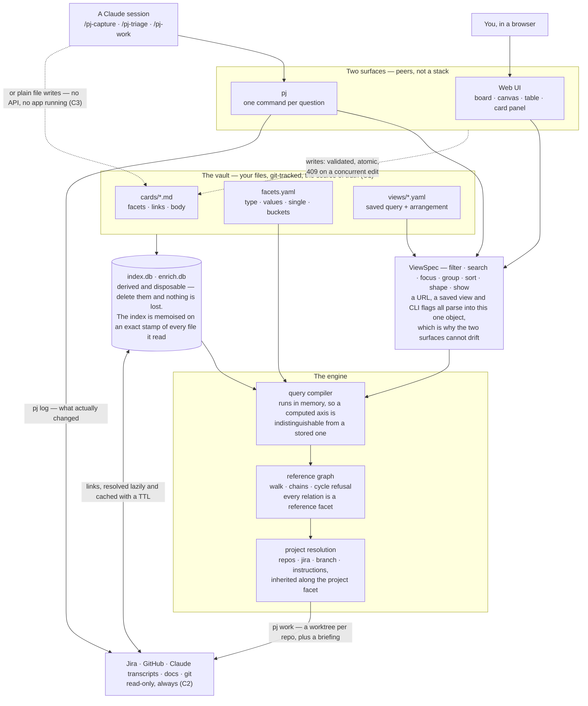

# Architecture

How projector works inside, and the invariants to preserve when changing it. For what the app *is* and
how to use it, see [README.md](README.md).

## Principles

These are decided. Most of the design is one of them being applied, and the source cites them by
number.

| | | |
|---|---|---|
| C1 | Markdown files are the source of truth | any index is derived and disposable |
| C2 | Everything external is read-only | no code path writes to Jira, GitHub, Trello or Slack |
| C3 | Cards stay agent-editable | an agent edits them with plain file writes — no API, no app running |
| C4 | No facet is privileged | every axis, relations included, is stored, filtered, grouped and written the same way |
| C5 | Every shape is equally first-class | all three are editable, not just viewable |
| C6 | The card body is free-form | description, links, files, images — no template |
| C7 | No freehand drawing | the canvas is records and their references. This is what settles the canvas library |
| C8 | Derived signals are deterministic | every count and badge is computed, never inferred by a model |
| C11 | Nothing derivable is also stored | one answer per question, so there is never a disagreement to arbitrate |
| C9 | A view is a query, not a place | `view = filter × search × focus × group × sort × shape × show`. Everything derivable is a live control; everything hand-curated is a saved-view-only key |
| C10 | Structure is edited by gesture, content in the panel | facets, `parent` and edges by drag and bulk bar; title, body, links and `project:` only through `?card=` |

## The shape of it

Three things are worth reading off it.

**The vault is three kinds of file, and only three.** Cards are content, `facets.yaml` is the
vocabulary that constrains them, and a view is a saved query plus the arrangement that has nowhere
else to live. Everything below the vault box is derived: delete both caches and `pj reindex` is
always correct.

**The two surfaces cannot drift, because `ViewSpec` is one object.** A URL, a `views/*.yaml` file and
a set of `pj` flags parse into the same thing, so `pj ls --view unblocked` and opening that view in
the browser are the same query by construction rather than by discipline.

**The file format is a public API.** The app writes through a gate that validates against the
vocabulary, writes a temp file and renames, and refuses a write whose file changed since it was read.
An agent writes the same bytes with Write/Edit and no gate at all (C3) — which is why the gate exists:
the two are expected to be editing the same card at the same time.

## Layout

| | |
|---|---|
| `src/schema/` | card and facet types, frontmatter read/write, validation |
| `src/index/` | the indexer, the query compiler, the reference graph, the index memo |
| `src/view/` | `ViewSpec` — the one description of a view, shared by URL, file and CLI flags — `payload.ts`, the one answer to it, shared by `GET /api/query` and `pj ls --json` — `intents.ts`, the edits a control makes to a view, and `dropOutcome.ts`, what a drag means |
| `src/server/` | hono routes, mutations, file watcher, SSE, vault seeding |
| `src/web/` | React: sidebar, three shapes, card panel |
| `src/cli/` | `pj` |
| `src/sources/` | the read-only way out: subprocess transport, Jira credential + GET, Claude transcripts |
| `src/enrich/` | read-only link fetchers, each with a TTL |
| `src/intake/` | channels that discover refs the vault does not have, and where each last got to |
| `src/agent/` | card context assembly, worktree workspaces, briefings, git history |

## The query compiler

`src/index/query.ts` is the whole engine, and `src/view/spec.ts` is the one description of a view —
shared by the URL, a saved file and `pj` flags, so the three cannot drift. `src/view/payload.ts` is the
one *answer* to that description, shared by `GET /api/query` and `pj ls --json`: the request half could
not drift while the response half was assembled inside a hono handler the CLI could not reach.
`pj ls --view unblocked` and opening that view in the browser go through the same code, and now return
the same thing.

**Filtering runs in memory** over the record map rather than in SQL. Not a performance trade — at this
scale both are free — it is what lets a pseudo-facet be indistinguishable from a real one. In SQL,
`blocked` and `triage` would each need their own expression in the filter, the grouping *and* the
histogram; in JS they need one function and the rest of the engine cannot tell them apart. SQLite keeps
the one job it is genuinely better at: full text (FTS5), which `search()` reads out of the `fts` table
joined to `records`. `src/index/queries.ts` holds only that, plus `counts`. The `blocks` closure came
in-memory too — `unblocks()` in `src/index/blocking.ts` walks the adjacency `refs.ts` builds, because
the SQL version was depth-capped at 10 and kept self-references the record map drops. It used to also carry a general `listRecords`/`filterClause` pair — a
second filtering engine, which is what this whole section says should not exist — and that is exactly
where `pj next` went on filtering by `kind` for two days after P7 deleted it. It then spent a while as
one `runQuery` call in `cmdNext` — right engine, wrong place, since a query written in TypeScript is a
view that is a place rather than a query (C9). It is `views/unblocked.yaml` now, and `blocked: [clear]`
already means "no unfinished blocker and nobody waited on". `pj check` validates every axis a view
names, so the `kind` failure cannot recur in its new home: a filter naming an axis the vocabulary lost
is an error, not an empty answer.

**Every pseudo-facet computes.** `kind` used to sit in `PSEUDO` and return a stored field. Moving it
into `facets.yaml` showed it asserted two things the record already said — carrying a `status` is what
makes it work, being named by **any** reference facet is what makes it a container — so it is gone
entirely (C11).
`type` and `is_project` are derived from the `project:` block, which is not a facet, so those earn
their place — and `type` also reads the reference graph, since its third value `node` is "some other
record names this one, through any reference facet". Five compute in all: `type`, `blocked`, `triage`, `staleness`, `linked`.

**Focus and filter are the same operation at two levels, deliberately.** A focus is a filter clause
whose test is transitive rather than one level deep, so in principle
`filter: { parent: { values: [project-a], depth: ∞ } }` would collapse them into one concept. The split is
kept because it is load-bearing for the facet panel: focus bounds the *universe* and filter refines
inside it, and the panel decides which facets to **offer** from the universe while computing **counts**
from the filtered pool. Collapse them and "38 filtered out" changes meaning. Worth revisiting only with
the histogram semantics settled first.

**Universe vs. hits.** `universe` is what focus and search left; `hits` is that narrowed by the facet
filter. The distinction is load-bearing in two places: the sidebar reports `universe − total` as
"filtered out", so the number is exact rather than inferred from the histogram; and the facet panel
decides *which facets to offer* from the universe while computing *counts* from the filtered pool.

**Two questions, not one.** Which facets are offered is decided by the universe, so refining one facet
never removes another — otherwise narrowing hard sheds the panel down to the one axis you already used,
with no way to look sideways. What each value counts lifts that facet's own selection and applies every
other one, so an unselected value says what adding it would bring; counted against the fully filtered
set instead, every unselected value reads 0 and a selection can be narrowed but never widened.

A facet with no real value anywhere in the universe is dropped, which is what keeps a niche taxonomy
out of the panel — and is why a facet needs no scoping rule of its own. Values the universe holds stay
listed at zero, and a
selected value always stays listed or it could never be unselected.

## The index memo

`load()` is memoised on an exact stamp of every file it reads — each mtime, plus how many files there
are. Rebuilding costs tens of milliseconds at this vault's size; checking the stamp costs a fraction of
one. The ratio is the point — two orders of magnitude — and it is what makes the memo worth having
rather than the absolute numbers, which move with the machine and the card count.

Before the query became interactive the index was rebuilt on every request, which was right while a
request meant a click. A live search box makes that several rebuilds a second. The stamp is not a TTL
or a heuristic, so C1 is intact: if any of those bytes could have changed, the answer is rebuilt.
Mutating routes additionally call `invalidate` through `bump`, so our own writes never depend on mtime
resolution being finer than a burst of them.

The memo also disposes the superseded `DatabaseSync`, which the per-request version leaked once per
request.

**Callers must not `await` between `load()` and their last read of what it returns**, or a concurrent
request could rebuild and dispose it mid-handler. Every call site today is a GET handler that returns
without suspending.

## Invariants

Things that look like details and are not. Each of these was a bug at some point.

**Arrangement merges, never replaces.** The client sends only the nodes it currently renders, and that
is a filtered subset — replacing the `nodes` map would silently discard the position of everything the
filter happened to hide. Same for `order`, per column. An entry is dropped only when its card is
actually gone, and the live-id set is built at most once per save.

**Saving a view keeps its arrangement.** *Save current as…* over an existing name replaces the query
wholesale and leaves `nodes`, `order` and `layout` alone, so refining a saved view's filter does not
cost you its layout.

**Two sentinels, one reason.** The server merges a saved view's parameters *under* the URL's, so an
absent key means "inherit". Clearing something therefore needs an explicit empty value: `f.status=`
means "no status filter" over a saved view that had one, and `focus=` means "no focus". Deleting the key
instead lets the saved value come straight back.

**`(none)` travels as itself** in the URL and in a view file, never as a bare `none`, so a facet that
one day has a literal value `none` cannot collide with the absence refinement.

**Canvas layout follows the *first* relation shown,** not `parent` alone. A hierarchy can lay a graph
out and a cross-cutting relation cannot — a blocker pointing sideways distorts every rank it crosses —
but which is which is a property of the view, not of the relation: `parent` first gives a
decomposition tree with dependencies drawn over it, `project` first gives the portfolio. Laying a
membership canvas out by `parent` puts every node in one column with the hierarchy invisible.

**One edge per pair of records,** whatever the relation. `parent` and `project` agreeing is the expected
shape for a record inside a project, so drawing both put two identical lines on top of each other. Collapsed, a
pair that agrees reads as one relationship and a pair that *disagrees* still shows as two edges pointing
at different records — the case worth seeing. Edge labels need an explicit neutral fill, because a label
inherits the stroke colour otherwise.

**Every relation is a reference facet.** `type: ref` says a facet's values are record ids, and
`parent`, `blocks` and `project` are the three that exist. There is no `edges:` block and no `edges`
table: `src/index/refs.ts` is the one reader, and focus, the canvas, the roll-ups, config inheritance
and cycle refusal all walk the `src names dst` pairs it returns.

The gain is not symmetry, it is capability. An edge could be traversed but never filtered, grouped,
counted, dragged or bulk-edited; a facet could be all of those but never traversed. Making relations
facets means `f.parent=project-a`, `groupBy: [parent]`, `parent=(none)` and drag-between-parent-columns all
exist, none of which did before — and they work because a hierarchy concentrates: 26 distinct parents
over 134 references, 7 used once.

A project's key is its record **id** — there is no separate `key` field, because a second name for one
thing is a second thing to keep in step, and it would let a reference point at something that is not a
record id.

**Direction is mechanical, not spatial.** `out` follows a record's own references; `in` finds the
records naming it. `up`/`down` only reads correctly for containment — on `blocks`, "up" would mean
toward the blocker, which is the same arrow as `parent`'s "down" — so the words would have meant
opposite tree-directions depending on the relation.

**A reference facet declares no vocabulary.** `values` on a `ref`, `date` or `number` facet is always a mistake — the vocabulary is
the vault — so `loadFacets` drops it rather than half-honouring it, and `open` is implied. A value
naming a record that does not exist is a **warning**, not an error: an agent may write a card before
the one it points at, and refusing that would make the order of two file writes matter.

**A relation carries no data of its own.** A reference facet value is a bare record id, so there is
nowhere to hang a label, a weight or a reason on a relationship. `Edge` was `{type, to}` and nothing
used more, and a reason for a blocker belongs in the body — accepted knowingly, since it is the one
thing the collapse gave up.

**Three SQLite files, three lifecycles.** `.index.db` is derived from the card files and rebuilt from
scratch whenever they change — C1 means it can never be the authority, so it needs no migration.
`.enrich.db` is a cache: TTL'd, clearable, and losing it costs one refetch of data that took a second
to fetch. `.intake.db` is neither. Delete it and the next sweep re-proposes every message and commit of
the last three months, so it cannot be rebuilt from anything and cannot be thrown away casually.

Merging any two of them breaks whichever has the shorter life: enrichment in the index would be
discarded on every reindex, and watermarks in the enrichment cache would be discarded by
`clearEnrichment`.

**A watermark is not load-bearing, and that is what makes it safe to keep at all.** It is the one piece
of state projector holds that is not derived from the card files. Correctness does not rest on it:
`source_fingerprint` is what stops a duplicate, and it stops one whether or not a cursor knows the
item exists. So the watermark only decides how far back to *look* — losing it degrades a sweep to a
default window, which is noisier and never wrong. Nothing about the work has two answers, so C1 is
untouched.

**A cursor may only move to a boundary with nothing unexamined behind it.** A cursor is one value, so a
channel that returned the *newest* N items and then advanced would step over everything older it never
looked at. Channels therefore work **oldest-first from the cursor**, and a run truncated by its limit
holds its cursor where it was: the next sweep resumes at the same place, and the backlog drains through
fingerprint dedup rather than through the cursor. `pj intake` is also the only command that reads
external state and writes nothing of its own — it rebuilds the derived index the way every read does,
and advancing a cursor is a separate explicit step, because a run that fetched is not a run that was
resolved.

**Enrichment and intake are mirror images that share only the way out.** Enrichment is given a ref and
answers how to display it; intake is given a channel and a cursor and answers which refs nobody has
filed. Same Jira token, same `~/.claude/projects`, opposite question. `src/sources/` holds what is
genuinely common — the credential, the subprocess, the transcript parser — and neither directory
imports the other. Two of the five intake channels have no fetcher here at all: Slack and Gmail are
read by an agent through MCP, and `pj` keeps their cursors anyway, because a watermark is a property of
where the sweep got to and not of who did the fetching.

**Instructions are configuration, not prose.** They live in the `project:` block. They were once a
`## Instructions` heading in the body matched by regex — the only place where renaming a heading
silently changed behaviour, with nothing to validate against. The body is free-form again (C6): nothing in
it is configuration. It is still read — `progressOf` counts its task boxes, `excerptOf` picks its first
prose paragraph for the card face, and `reindex` puts it in FTS5 — but no heading or marker in it
changes how the app behaves.

**Cycles are refused on every reference facet**, through the one `wouldCycle` that also guards `parent`
edges. It takes the outward neighbours as a function rather than a record map, so the check is about
the shape of the graph rather than where it is stored. Before P7 a membership cycle was accepted and
`resolveProject` silently truncated the config chain.

**Blocked and waiting are computed, never written.** `blocked` is an unfinished `blocks` reference and
`waiting` is a non-empty `waiting_on`; neither is a `status` value. `status` is lifecycle only —
`planning · active · frozen · done · archived`. Storing a state beside the thing it is derived from
gives two answers to one question and nothing to arbitrate between them (C11).

**A single-valued facet is a vocabulary constraint, not a storage one.** Every facet is a `string[]`
and the whole engine reads it that way; `single: true` says the *vocabulary* admits one value at a
time, which is why it lives in `facets.yaml` beside `open` and `values`. Without it the model cannot
reject `status: [planning, done]` — a record in no coherent state, which `buildCtx` reads as done while
a board draws it in planning. That matters because the primary writer is an agent making plain file
writes (C3): a model that cannot refuse an incoherent state accumulates them.

**A facet has a type, and storage is uniform anyway.** `label · ref · date · number` say what values
*are*; the file still holds strings and the engine still holds `string[]`. That is what keeps typing
cheap *in the compiler*: it interprets a type in exactly two places — `valuesOf` for what an axis
shows, `rankOf`/`ordered` for how it sorts. Outside the compiler the type is read at about two dozen
sites, through `isRef`/`isOrdered` in `src/schema/vocabulary.ts` or by comparing `def.type` directly in
the writer, the validator, the payload builder and the editing controls — so adding a type means
auditing those rather than one function.

**An ordered facet presents buckets and compares raw.** A date has as many values as there are days, so
filtering and grouping see the buckets it declares while sorting and range filters see the value.
`f.due=overdue` and `f.due=>2026-09-01` are lexically distinct, so there is nothing to disambiguate.
`orderValues` reads the bucket order from `buckets` — without that it fell through to alphabetical,
which put `later` first.

**`created` and `updated` stay fields.** A facet is *user-declared vocabulary*; those two are written
by the app on every save and belong in no filter panel. That line is why `due` could move out of the
frontmatter root and they cannot, and it is what leaves `staleness` a pseudo-facet: it computes over
`updated`, which is not vocabulary. Computing over app-written metadata is `PSEUDO`'s residual role.

**One face, for every record**, and one list saying what it shows. `chips` and `edges.show` asked the
same question — *which facets does this view surface* — and how each is drawn follows from what it is:
a label is a chip and a column, a reference is those *and* a line, and the first reference in `show`
lays the canvas out. Two keys meant "why does my canvas draw nothing" was answered by the one you
forgot.

**`connect` follows the shape *and* the relation drawn.** Only a canvas honours it, so it is not a
query key — it is a run option carrying the relation to walk, decided by the shape and the vocabulary
together, which the query half knows nothing about. Passing the relation rather than a flag is what
stops a canvas laying out along one hierarchy and pulling context from another. `layoutRelation` is the
single answer to *which relation*, computed server-side and sent as `layout`, so the client never
recomputes it.

**Conflicts are refused, not merged.** A card read into the panel carries its file mtime; a write sends
it back and a mismatch is a 409. This matters because an agent may be editing the same file in another
window (C3).

**Grouping is one function called twice.** A second axis is a position in `groupBy`, not a separate
`swimlanes` concept, which is why a matrix needed no new code path. Every value the query *admits* gets
a group, empty or not — a board missing an admitted column reads as though it did not exist, and an
empty admitted column is somewhere to drag a card to.

**A filter on the axis you group by decides which columns exist, not just what lands in them.** It read
every declared value whatever the filter said, so `due` — grouped by `due`, filtered to three of its
four buckets — drew a `later` column no card could reach, and `triage` drew `complete` the same way. It
also dropped every *undeclared* value, so whether an excluded value survived came down to whether
somebody had written it in `facets.yaml`. `admitted` answers for both: the axis is the vocabulary
narrowed to the selection. Two consequences worth stating. A selection by *range* (`f.due=>2026-09-01`)
narrows nothing, because its tokens are expressions rather than value names — and because the property
that makes narrowing safe is that a card matching a name selection must carry one of those names, so it
always keeps a column; a range match need not. And on a multi-valued axis the narrowing drops
*placements*: filtering `tech` to `k8s` stops drawing the `aws` column those same cards also sit in.
That is the point rather than a cost — a column headed `aws` in a view that holds only `k8s` cards
invites the wrong reading — but it is why `placements` can now fall below what the vocabulary would
have shown.

A **table** draws groups as sections, and follows the canvas rather than the board: an empty declared
value gets no section. The board's case for keeping one is that it is somewhere to *drag to*, and a
table offers nothing to drag. It used to render a header with a `0` under it, which was a behaviour
rather than a decision — all three now go through one `groupsFor`, which takes the policy as an
argument precisely because it differs on purpose.

A canvas draws groups as **bands**. It cannot honour a multi-valued placement, because a record has one
position, so it draws the card in the first group the axis declares and the footer reports the count
rather than letting the two shapes disagree silently. An empty declared value gets no band: an empty
column is somewhere to *drag to*, and a canvas drag moves a position without changing a facet, so an
empty band would be decoration with no affordance. The bands are plain nodes behind the records rather
than React Flow parents — a parent makes member positions relative, and a saved arrangement stores
absolute ones. Boxes are measured from where members finally are, so a dragged card grows its band and
clustering needs no agreement with the arrangement.

## What it writes

C2 says everything external is read-only. Concretely, every operation that writes anything:

| Operation | Writes | Never |
|---|---|---|
| `pj add` / `POST /api/card` | one new card file | never overwrites an existing file |
| `pj log` | nothing | reads `git log`; it is the one command with no write at all |
| `pj link`, `pj set`, `PATCH /api/card/:id` | one card's frontmatter, or its body when `body` is sent | a frontmatter change never touches body bytes |
| `pj set --set path=yaml` | only the top-level keys the paths touch | comments and formatting elsewhere in the file survive |
| `POST /api/bulk` ops `facet`, `move`, `parent` | many cards' frontmatter — `facet` writes one axis uniformly, `move` writes one axis per grouping axis the drag crossed, `parent` is `bulkFacet` under the name the bulk bar uses | one write per card whatever the op; the `delete` op is the row below |
| `PUT /api/card/:id/frontmatter` | one card's whole frontmatter block | never touches the body |
| `pj rm`, `DELETE /api/card/:id`, `POST /api/bulk` | card files, and every reference that pointed at them | nothing outside `cards/` |
| `PUT /api/view/:name` | one view file's query half | never touches its stored arrangement |
| `PATCH /api/view/:name/arrangement` | one view file's `nodes`/`order`, merged by id, plus `layout: manual` whenever positions are sent | never drops an entry whose card still exists |
| `DELETE /api/view/:name` | one view file | never touches the cards it selected |
| `POST /api/card/:id/asset` | one file under `cards/assets/<id>/` | never overwrites: the name is a content hash |
| `POST`/`DELETE /api/vaults` | `vaults.json` beside the app — plus, when `create` is passed for a path that is not a vault yet, everything `initVault` seeds | never writes into a non-empty directory that is not already a vault, and never overwrites a file that exists |
| `pj intake` | `.index.db`, because a sweep reads the vault through `reindex` like any other read | proposes; it writes no card and moves no cursor |
| `pj intake commit` | one row in `.intake.db` | never a card, and never on its own initiative |
| `pj work` | a workspace directory under `$PROJECTOR_WORKSPACES`, `AGENT_BRIEFING.md` in it, and a git worktree plus its branch in each declared repo | never modifies a tracked file in a declared repo |
| `pj vaults add` / `forget` | `vaults.json` beside the app — plus, with `--create`, everything `initVault` seeds | never writes into a non-empty directory that is not already a vault |
| everything else | `.index.db`, `.enrich.db` and `.intake.db` only | never touches a card file |

The only outbound calls are reads: `gh pr view`, `gh api` GETs, Jira GETs. Fetcher modules export no
mutation functions, so there is no code path to write back.

A mutating request is refused when it carries an `Origin` header that is not one of ours, since a
localhost server is reachable from any page open in the browser. Every frontmatter write goes through
`writeCardFile`, which writes a temp file and renames, so a concurrent reader never sees half a file.

## Everything it touches

The complete filesystem surface, audited. Nothing else on disk is read or written.

**Writes — inside a vault, plus two files of its own:**

| Path | What | When |
|---|---|---|
| `<vault>/cards/**` | card files, and assets under `cards/assets/<id>/` | you create or edit a card |
| `<vault>/views/*.yaml` | saved views | you save a view or its arrangement |
| `<vault>/.index.db`, `<vault>/.enrich.db` | the derived index and the enrichment cache | continuously; both are disposable and gitignored |
| `<vault>/.intake.db` | where each intake channel last got to | only `pj intake commit`; gitignored |
| `<app>/vaults.json` | the list of vaults you have opened | you open or forget a vault |
| `$PROJECTOR_WORKSPACES/<card>/` (required; no default) | `pj work` worktrees and `AGENT_BRIEFING.md` | only `pj work` |

Every card write goes through `writeCardFile` — temp file plus rename — so a concurrent reader never
sees half a file. The registry is written the same way.

**Reads outside a vault:**

| Path | Why | Surface |
|---|---|---|
| `~/.claude/projects/**`, `~/.claude/sessions` | resolving a `claude:` link, and discovering sessions that moved | read-only |
| `~/Library/Application Support/Claude/claude-code-sessions/<org>/<account>/*.json` | the Claude Desktop store — a different vendor surface with its own `local_` id space, for a `claude:` link whose session lives there | read-only |
| any absolute or `../` path in a `doc:` link | the link points there deliberately | read-only, one file |
| any directory, via `GET /api/vaults/browse` | the folder picker | directory *names* only, no file contents |
| a project's declared `repos` | `pj work`, through `git`; `pj intake` reading `git log` | `git worktree`, `git fetch`, `git log` |

`doc:` and the folder picker are the two places a path outside the vault is reachable, and both are
deliberate: a `doc:` ref is something you typed, and a picker that cannot leave one directory cannot
pick a folder. Neither reads anything you have not named.

**Subprocesses:** `git` (worktrees in declared repos, `log`/`cat-file` in the vault for `pj log`, and
`log`/`branch`/`config`/`remote` in declared repos for `pj intake git`),
`gh` (`pr view`, `api` GETs), `osascript` (opening a terminal, `pj work` only), and `ps` (one `ppid`
read per level, walking up the process tree to find which live Claude session is asking). No shell —
`execFile`/`execFileSync`/`spawnSync`, always with an argument array, so
nothing is interpolated into a command line. AppleScript quoting is applied on top of shell quoting,
because a path may contain a quote.

**Environment:**

| | |
|---|---|
| `PROJECTOR_DATA` | the vault, for the CLI |
| `PROJECTOR_PORT` | server port (default 8092) |
| `PROJECTOR_WORKSPACES` | where `pj work` puts worktrees. **Required** — `pj work` refuses rather than guessing a directory to create real worktrees in |
| `PROJECTOR_JIRA_URL`, `PROJECTOR_JIRA_EMAIL`, `PROJECTOR_JIRA_TOKEN` | Jira, for both enrichment and intake; absent means Jira links show their key and nothing more |
| `PROJECTOR_INTAKE_JQL` | overrides the JQL `pj intake jira` searches with |
| `PROJECTOR_GIT_AUTHOR` | whose commits `pj intake git` looks for (default: each repo's own `user.email`) |
| `PROJECTOR_VAULTS` | where the registry file lives (default: `vaults.json` beside the app — the qualifier on *Why the registry is a file*) |
| `PROJECTOR_CLAUDE_HOME` | where `~/.claude` is, for transcripts and live sessions |
| `PROJECTOR_CLAUDE_DESKTOP` | where the Claude Desktop session store is |
| `PROJECTOR_DOC_URL` | an editor URL template for `doc:` links (`cursor://file{path}`); absent means a copyable command instead |

No credential is read from anywhere but the environment, and none reaches the browser: enrichment
responses carry the resolved fields, never the token.

## Why the registry is a file

`vaults.json` cannot be `localStorage`, because the **server** is the party that needs it. A request
names its vault in an `X-Projector-Vault` header, and the server refuses a path that is not registered —
so the header is a reference to a folder you chose rather than an arbitrary path a page can name.
`localStorage` is browser-side; the server cannot read it.

It sits next to the app rather than in `~/.projector`, so an install carries its own list: nothing is
written to your home directory, and two installs cannot fight over one file. It is gitignored, because
it holds local paths and belongs to the install rather than the code.

Verified behaviour: an unregistered path gets 428, and a cross-origin request is refused twice over —
the custom header forces a CORS preflight that no origin of ours answers, and a mutating request with a
foreign `Origin` is rejected outright.

The CLI does not depend on the registry at all: `vaultAbove` walks up from the working directory the way
git finds a repository, so `pj` works inside any vault whether or not the app has ever opened it. The
registry is then only the browser's memory of which folders you use — delete it and you lose the list,
nothing else.

## Vault seeding

`initVault` writes `cards/`, `cards/assets/`, `views/`, `facets.yaml`, five starter views — `home`,
`due`, `projects`, `unblocked`, `everything` — and a `.gitignore`. **No prose.**

It used to also write `cards/README.md`, a per-vault conventions document from `SEED_README`. That was
a near-verbatim copy of the `projector` skill, and its only audience — an agent editing card files
directly — already loads the skill. Two documents stating the card format is one document to drift, so
the format is now written down in exactly two places that cannot disagree: `src/schema/card.ts`, which
parses it, and the skill, which explains it.

`listCardFiles` and `countCards` still exclude `README.md` by name. That guard stays because a folder
full of markdown attracts a README, not because the app puts one there.

## Stack

- **`@xyflow/react`** for the canvas. The requirement that settles it: a node must contain arbitrary
  React, because a card face renders live Jira/PR/session chips. `tldraw` needs a commercial licence and
  is shape-model-first; `excalidraw` is sketch-first; `cytoscape` and `konva` cannot host a React
  component inside a node. C7 makes the "but no freehand" trade-off a non-issue.
- **`@dagrejs/dagre`** for auto-layout. `rankdir: LR` reproduces a mind-map directly.
- **`@atlaskit/pragmatic-drag-and-drop`** for the board. What Trello and Jira run on, under 5KB, built
  on native drag events so React StrictMode is a non-issue.
- **CodeMirror 6** for the body, and the reasoning matters more than the library. A ProseMirror-based
  WYSIWYG round-trips content through a document model and *re-serialises* markdown on save. Under
  C1+C3 that is actively harmful: it silently reformats agent-authored files, churns git diffs, and can
  drop constructs it does not model. CodeMirror edits the text itself.
- **`yaml`** for writes. Its Document API patches surgically, preserving comments, key order and
  formatting, so a file the app wrote is indistinguishable from a hand-edited one. `gray-matter`
  re-serialises the whole block.
- **`node:sqlite`**, built in. FTS5 verified and in use; recursive CTEs are headroom nothing currently
  needs. No native rebuild, nothing to install.
- **`hono`** for the server — typed routing, a first-class SSE helper, static files: the three things
  this server does.
- **No client-side query cache.** The rendering rule is stale-while-revalidate, which is what TanStack
  Query is for, but the server already owns the cache and answers from localhost in under a millisecond.
  A second cache with a second staleness model in front of that is only something extra to reason about.

## Tests

`node --test test/*.test.ts`

| | |
|---|---|
| `agent.test.ts` | branch naming, AppleScript quoting through both layers, base-branch fallback, worktree preparation, and `pj log` reading status transitions out of git diffs |
| `arrangement.test.ts` | positions and card order merge rather than replace; save keeps arrangement |
| `canvas.test.ts` | nested `--set` and its validation against the result, deleting a record's inbound references, clusters, bands, and the layout following only the relation shown |
| `card.test.ts` | frontmatter round-trips byte-for-byte, surgical key patching, link parsing and hrefs, typed and single-valued facets |
| `cli.test.ts` | every command refusing an unknown flag, `--json` being the payload the app receives, the registry, exit codes |
| `client.test.ts` | body sanitising, asset path rewriting, edge collapse and direction, clearing a URL-only override |
| `enrich.test.ts` | the fetch coalescer: awaited refreshes, cached errors, borrowed fetches, a thrower that still settles |
| `fetchers.test.ts` | each fetcher's parse-and-explain half, with nothing reaching the network |
| `gesture.test.ts` | drag semantics: replace / ⌥ add / ⇧ remove, `(none)`, reorder, matrix diagonals, connect |
| `intake.test.ts` | the watermark discipline: an opaque cursor round-trips, a null commit leaves it, a truncated run holds it, a sweep writes nothing, dedup works with no cursor at all; plus evidence reasons, worktree path parsing, and an FTS query built from a prompt full of operators |
| `mutate.test.ts` | the write gate: per-card moves, bulk modes, vocabulary enforcement, cycle refusal, mtime conflicts, assets |
| `panel.test.ts` | the panel's write plans, which base mtime each carries, and how a conflict is reported |
| `project.test.ts` | project resolution and inheritance, reference chains, cycles terminating rather than hanging |
| `query.test.ts` | the compiler: filters, `(none)`, ranges, pseudo-facets, buckets, references, focus traversals, grouping, counts, FTS |
| `selection.test.ts` | cmd-click, shift-click runs, and a selection never mutated in place |
| `source.test.ts` | no source file hides a control byte from grep |
| `spec.test.ts` | `ViewSpec` round-trips through URL params and files; which relation lays a canvas out |
| `theme.test.ts` | the design system's invariants: the size and radius scales, token declare/use symmetry, DESIGN.md naming the same tokens and every `components:` reference resolving — plus the rules that were prose until they drifted, namely uppercase only at the Label step, `appearance: none` on the shared field rule, no keyframes and no transition over 140ms, one `@media`, one hue family per facet axis, every `className` resolving to a rule, and this table naming the tests that exist |
| `vault.test.ts` | vault detection and path normalisation, `doc:` resolution, and every seeded file parsing as what it claims to be |
| `view.test.ts` | a view file patched in place, an unknown axis refused in every position, the empty-group policy |

The query tests build their own temp vault rather than reading the real one, so they assert the engine
and not whatever the cards happen to say today. `tsconfig` runs with `noUnusedLocals` and
`noUnusedParameters`: a function that outlives the field it read is a compile error rather than
something a later reader has to notice.
