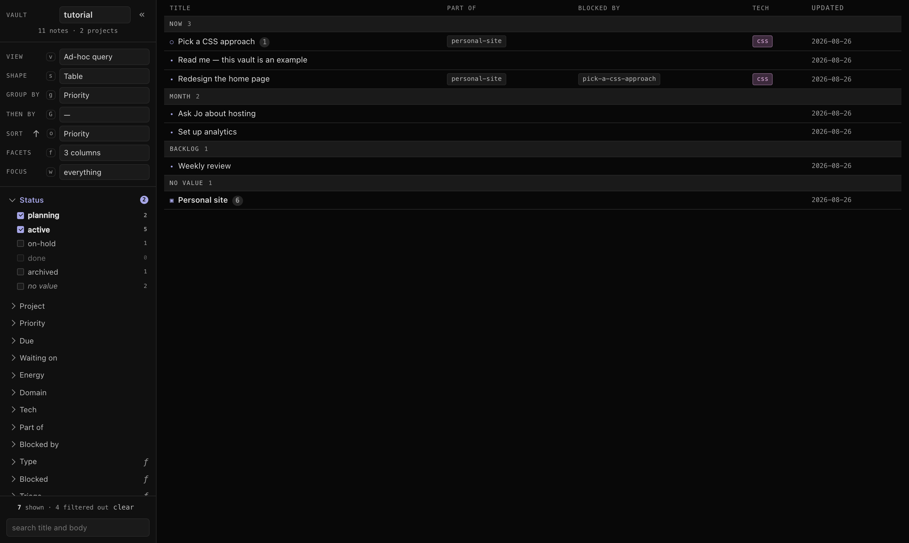
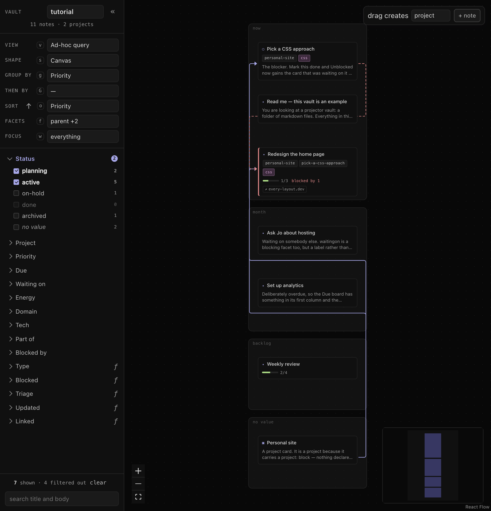

# projector

[](https://github.com/kramar42/projector/actions/workflows/ci.yml)

Work scatters. The issue tracker holds the shared work, email and chat hold the asks, markdown
notes hold the thinking, and the picture of what to do next lives in none of them. projector is a
personal work-management app for that gap: one database of markdown notes, drawn as a **board**, a
**mind-map canvas** or a **table**, whichever the current question asks for, with read-only inline
views of Jira issues, GitHub PRs, Claude sessions and local docs.

The name is the pun it looks like. A **project** is a collection of items with a shared context. A
**projection** is one way of looking at something that has more dimensions than any single view can
show. The app is named after doing both.

**The same query, three shapes.** Same filter, same grouping, one control moved. Click any of them
for full size.

<p align="center">
  <a href="docs/img/board.png"></a>
  <a href="docs/img/table.png"></a>
  <a href="docs/img/canvas.png"></a>
</p>

<p align="center">
  <sub><b>board</b> — planning, grouped by priority &nbsp;·&nbsp; <b>table</b> — the natural summary once
  there are too many to scan &nbsp;·&nbsp; <b>canvas</b> — relations, where <code>parent</code> lays out
  the tree and an unfinished blocker is a dashed red edge</sub>
</p>

## Why it exists

My work lives in systems that are also everyone else's. The issue tracker is where I work with other
people, email and messages are personal communication and asks, and a folder of markdown captures my
notes. On top of those I used Trello for priorities and projects, Excalidraw and Miro for high-level
design, and a table whenever a board grew past what one screen could show. Each tool held a fragment,
and none of them was the truth. Trello's limit was the plainest version of the problem: a card is
stuck to its list, so there is no way to keep the notes and change the view.

Capturing everything made it worse before it made it better. A system that captures everything greets
you every morning with a hundred-item list, and I drowned in mine. So filtering things *out* is the
central job here. A view that shows one project's actionable notes, meaning open, nobody waited on, no
unfinished blocker, decides whether the system extends your attention or spends it.

Switching the shape leaves the rest of the view alone, so no way of looking at the notes gets to be
the default: the board when planning, the table when there are too many notes, the canvas when the
question is how things relate. Same notes, same filter, one control moved.

The files are markdown because markdown is readable by people and by machines, diffable through git,
composable, open, and independent of any program, this one included. There is nothing here to be
locked into.

Nothing is ever written back to Jira, GitHub, Trello or Slack. This is a *personal* context layer, and
it should be invisible to everyone else. A note carries the text, the facets, the links and the refs,
so I do not have to remember that these three Slack messages are about that Jira issue. The systems
other people see stay exactly as they were.

The whole loop is **capture → triage → project** *(the verb)* **→ work**, and because projects nest
and combine context, by the time work starts the context is as full as it can be.

The rest of the design follows from three promises:

- your markdown files are the source of truth. Every index is derived and disposable: delete it and
  nothing is lost
- nothing is ever written back to Jira, GitHub, Trello or Slack. Nothing is written where somebody
  else reads — a notification to yourself is not one of those, and stays on your machine anyway
- the vocabulary is yours. Which axes a note can carry, and what each one means, are declared in your
  vault rather than built into the app

## Install

[Bun](https://bun.com) 1.4+ (or Node 24+ as the fallback). The runtime executes the server and CLI
TypeScript directly; only the web UI is compiled ahead of time.

```bash
git clone https://github.com/kramar42/projector && cd projector
bun install
bun run build && bun run serve
```

Then open <http://127.0.0.1:8092>. On first run it asks for a folder; point it at an empty one and it
sets itself up with a starter vocabulary and a few saved views under `.projector/`, plus a `.gitignore`
for the caches. Your notes go in the folder itself. One process, one URL: the server serves the built UI.

The CLI needs nothing running:

```bash
alias pj="bun '$PWD/src/cli/pj.ts'"   # from the project root: the outer quotes freeze the path
pj ls --group priority                # now run it from inside any vault
```

Bun is the default runtime and the only package manager — the scripts invoke it explicitly, so
`bun install`, `bun run serve` and `bun test` always run under Bun rather than whichever runtime is on
`PATH`. Node 24+ still runs everything directly (`node --test`, `node src/server/serve.ts`,
`node src/cli/pj.ts`), and CI keeps that floor honest. See [Toolchain](docs/MANUAL.md#toolchain).

## The words

The rest of the vocabulary is built out of these.

| | |
|---|---|
| **note** | one markdown file in the vault, and the only kind of thing a vault holds |
| **facet** | an axis a note carries values on (`status`, `priority`, `parent`), declared in `facets.yaml`. Every value is an array |
| **project** | a note carrying a block of configuration that its members inherit |
| **view** | a saved query, and how it is drawn |
| **shape** | `table`, `board`, `calendar` or `graph`. A view is a query; the shape is one field of it |
| **vault** | a folder of markdown, with the vocabulary and the saved views under `.projector/` |

An axis labelled `ƒ` is *computed* from the notes rather than stored on them: `blocked`, `triage`,
`staleness`.

The full glossary is at the top of [docs/MANUAL.md](docs/MANUAL.md), which defines every word the app,
the docs and the CLI use.

## What it does

**Everything is a query.** A view is `filter × search × focus × group × sort × shape`. Grouping a
board by project and grouping it by priority are the same board with one control moved, so there is
only ever one board to keep in step. Change the shape and the same notes are drawn as a graph.

**Relations are ordinary facets.** `parent`, `blocked_by` and `project` are facets whose values happen
to be note ids, so they filter, group and sort like every other axis. That is what makes a mind-map
leaf and a tracked task the same file.

**Links point outward.** A note can carry a Jira issue, a GitHub PR, a Claude session or a local doc.
Each one is fetched, cached and shown inline, and none of them is ever written to.

**An agent is a first-class writer.** Notes are plain files, so a Claude session creates and edits
them directly, with no API and nothing running. Judgement is where the agent earns its place: sweeping
the intake, filling in facets, triage. The deterministic parts stay deterministic, so enrichment is
plain fetching and every count on screen is computed rather than guessed.

**The vocabulary is extensible.** Facets are declared per vault, so every vault tracks exactly what
its domain needs. Link kinds and their enrichments, intake sources, and new shapes such as a calendar
or a timeline are additions to a registry rather than rewrites.

## Documentation

| | |
|---|---|
| [docs/MANUAL.md](docs/MANUAL.md) | how to use it — the model, the query language, the shapes, the CLI, the keymap, the file format |
| [docs/ARCHITECTURE.md](docs/ARCHITECTURE.md) | how it works inside, and the invariants to keep when changing it |
| [docs/DESIGN.md](docs/DESIGN.md) | the visual system — palette, type scale, the rules components follow |
| [docs/PRODUCT.md](docs/PRODUCT.md) | who it is for, and why |
| [docs/NEXT.md](docs/NEXT.md) | what is deliberately not being done, and why |
| [CLAUDE.md](CLAUDE.md) | working in this repo with an agent |

[docs/README.md](docs/README.md) is the map, if you would rather start there.

## Status

A single-user personal project, dogfooded daily. It runs on your own machine against your own files:
no server, no account, no telemetry. It is desktop-only by construction, with no breakpoints and no
responsive layout at all. There is no release, no packaging and no support, and the file format is not
promised to be stable yet. Because the files are plain markdown, the worst case is a folder of notes
you can read anywhere.

## License

[0BSD](LICENSE) — do whatever you like with it, no attribution required.
