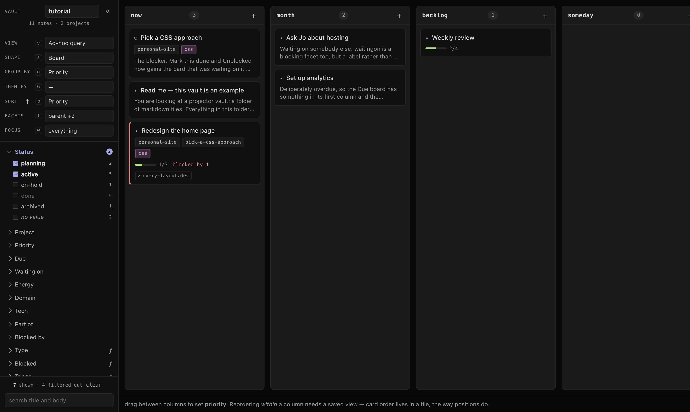

# projector

<!-- TODO(you): one sentence a stranger can finish and know whether to keep reading.
     The line below is your existing opener. It is accurate, but it leads with the
     mechanism — "one note database, projected as three things" — which lands for
     someone who already wants that and slides off everyone else. Consider leading
     with the shape of the problem instead, and letting the mechanism be the second
     sentence. Your call; it depends on whether the first readers are the university
     friends (who need the problem) or other people (who will recognise the mechanism). -->

A personal work-management app. One database of markdown notes, drawn as a **board**, a **mind-map
canvas** or a **table** — whichever the current query asks for, with read-only inline views of Jira
issues, GitHub PRs, Claude sessions and local docs.

<!-- TODO(you): drop the screenshot in and uncomment. Left commented so the README does
     not ship a broken image in the meantime.

-->

<!-- TODO(you): three shots of the SAME query in all three shapes, side by side, is the entire
     pitch in one row and needs no caption. If you only ship one, ship the canvas — it is the
     thing no board tool does, so it is the image that raises a question. -->

## Why it exists

<!-- TODO(you): this section carries the file, and nothing in the repo says it yet.
     docs/PRODUCT.md has positioning ("replaces the need for trello, miro") but not reasoning.
     Worth saying, in your own words and roughly this order:

       - what you were doing before this, and what specifically broke about it. Not "it was
         annoying" — the failure. A hand-kept TODO.md going stale, work falling between Jira and
         Slack, whichever it actually was.
       - why "real TODOs and conceptual mind-maps in one place" is a problem and not a taste.
         What went wrong when they lived in two tools that a stranger would recognise.
       - why markdown files on disk rather than an app with a database. The honest reason.
       - why nothing is ever written back to Jira, GitHub or Slack. This is an unusual, strongly
         held constraint and a stranger reads it as a missing feature until you say why it is a
         choice. This may be the most interesting paragraph in the README.
       - optionally: what building it taught you. That is the reason a friend keeps reading.

     Half a screen. A stranger's patience for someone else's motivation is thin — but zero
     paragraphs here makes the whole repo read as a tool nobody needed. -->

Three promises shape everything else:

- **your markdown files are the source of truth** — every index is derived and disposable; delete it
  and nothing is lost
- **nothing is ever written back** to Jira, GitHub, Trello or Slack. Everything external is read-only
- **the vocabulary is yours** — which axes a note can carry, and what each one means, are declared in
  your vault rather than built into the app

## Install

[Bun](https://bun.com) or Node 24+. Nothing is compiled ahead of time except the web UI, so there is
no build step for the server or the CLI.

```bash
git clone <TODO(you): url> && cd projector
bun install
bun run build && bun run serve
```

Then open <http://127.0.0.1:8092>. On first run it asks for a folder; point it at an empty one and it
sets itself up — a starter vocabulary and a few saved views under `.projector/`, and a `.gitignore`
for the caches. Your notes go in the folder itself. One process, one URL: the server serves the built UI.

The CLI needs nothing running:

```bash
alias pj="bun '$PWD/src/cli/pj.ts'"   # from the project root: the outer quotes freeze the path
pj ls --group priority                # now run it from inside any vault
```

**Nothing here is pinned to Bun.** The package scripts spell `node`, because Node is the floor
`engines` promises; Bun runs them because `bun run` substitutes itself for `node`. So the runtime is
whichever launcher you type — `bun run serve`, `node --run serve` and `pnpm serve` are the same script
on three runtimes, and `npm`, `pnpm` and `yarn` all install it. CI exercises every combination; see
[Toolchain](docs/MANUAL.md#toolchain) for the one command that is an exception and why.

<!-- TODO(you): a CI badge belongs here or under the title if you want one. There is a real
     workflow to point at, so it would not be decoration. -->

## The words

Six terms carry the rest.

| | |
|---|---|
| **note** | one markdown file in the vault, and the only kind of thing a vault holds |
| **facet** | an axis a note carries values on — `status`, `priority`, `parent` — declared in `facets.yaml`. Every value is an array |
| **project** | a note carrying a block of configuration that its members inherit |
| **view** | a saved query, and how it is drawn |
| **shape** | `board`, `canvas` or `table`. A view is a query; the shape is one field of it |
| **vault** | a folder of markdown, with the vocabulary and the saved views under `.projector/` |

<!-- TODO(you): decide whether "computed axis" earns a seventh row. Against: it is a mechanism,
     and mechanisms belong in the manual. For: a stranger meets `ƒ` on screen in the first
     minute with no way to guess what it means. -->

The full glossary is at the top of [docs/MANUAL.md](docs/MANUAL.md), which defines every word the app,
the docs and the CLI use.

## What it does

**Everything is a query.** A view is `filter × search × focus × group × sort × shape`. Grouping a
board by project and grouping it by priority are the same board with one control moved, not two
boards to keep in step — and changing the shape draws the same notes as a canvas.

**No facet is privileged.** Relations — `parent`, `blocked_by`, `project` — are facets whose values
happen to be note ids, so they filter, group and sort like every other axis. That is what makes a
mind-map leaf and a tracked task the same file.

**Links point outward, and only outward.** A note can carry a Jira issue, a GitHub PR, a Claude
session or a local doc. Each is fetched, cached and shown inline, and none is ever written to.

<!-- TODO(you): keep, cut, or move down — your call, and it depends on the audience.
     For some readers this is the most interesting line in the README; for others it is the one
     that makes a real tool look like an AI demo. -->
**An agent is a first-class writer.** Notes are plain files, so a Claude session creates and edits
them directly — no API, nothing running. Four slash commands in `.claude/skills/` do the sweeping,
the sorting, and the setting-up-to-work.

<!-- TODO(you): a fourth bullet only if there is one thing you are actually pleased with that
     the three above miss. Resist a feature list — the manual is for that. -->

## Documentation

| | |
|---|---|
| [docs/MANUAL.md](docs/MANUAL.md) | how to use it — the model, the query language, the shapes, the CLI, the keymap, the file format |
| [docs/ARCHITECTURE.md](docs/ARCHITECTURE.md) | how it works inside, and the invariants to keep when changing it |
| [docs/DESIGN.md](docs/DESIGN.md) | the visual system — palette, type scale, the rules components follow |
| [docs/PRODUCT.md](docs/PRODUCT.md) | who it is for, and why |
| [docs/NEXT.md](docs/NEXT.md) | what is deliberately not being done, and why |
| [CLAUDE.md](CLAUDE.md) | working in this repo with an agent |

[docs/README.md](docs/README.md) is the map, if you would rather start there.

## Status

<!-- TODO(you): one honest paragraph. A stranger's real first question is "is this maintained,
     and can I use it?" Things worth being plain about:
       - a single-user personal project, dogfooded daily, no release and no packaging
       - runs on your own machine against your own files; there is no server and no account
       - desktop-only by construction — no breakpoints, no responsive layout at all
       - no support, and no promise the file format is stable
     Being direct here is what makes the rest of the README trustworthy. Understating it is
     worse than overstating it: a friend who tries it and hits a wall you knew about will
     trust the docs less afterwards. -->

## License

[0BSD](LICENSE) — do whatever you like with it, no attribution required.
