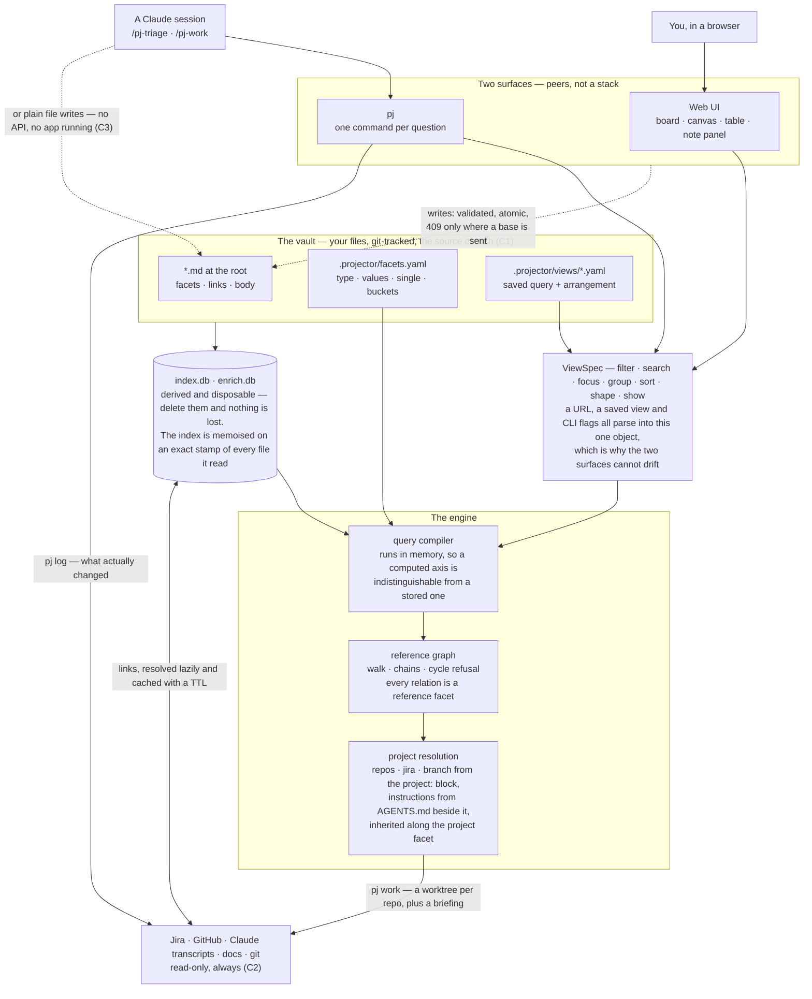

# Architecture

How projector works inside, and the invariants to preserve when changing it. For what the app *is*,
see [README.md](../README.md); for how to use it, [MANUAL.md](MANUAL.md).

## Principles

These are decided. Most of the design is one of them being applied, and the source cites them by
number.

| | | |
|---|---|---|
| C1 | Markdown files are the source of truth | any index is derived and disposable |
| C2 | Nothing is written where somebody else reads | no code path writes to Jira, GitHub, Trello or Slack. A sink only you read — a notification to yourself — is not one of those |
| C3 | Notes stay agent-editable | an agent edits them with plain file writes — no API, no app running |
| C4 | No facet is privileged | every axis, relations included, is stored, filtered, grouped and written the same way |
| C5 | Every shape a query projects into is equally first-class | board, canvas, table and calendar are editable, not just viewable — and there are exactly four. A composition is not a fifth: it decides where the columns come from, not how they are drawn, so it is the `lists` grouping axis and every shape draws it |
| C6 | The note body is free-form | description, links, files, images — no template |
| C7 | No freehand drawing | the canvas is notes and their references. This is what settles the canvas library |
| C8 | Derived signals are deterministic | every count and badge is computed, never inferred by a model |
| C11 | Nothing derivable is also stored | one answer per question, so there is never a disagreement to arbitrate |
| C9 | A view is a query, not a place | `view = filter × search × focus × group × sort × shape × show`. Everything derivable is a live control; everything hand-curated is a saved-view-only key |
| C10 | Structure is edited by gesture, content in the panel | facets, `parent` and edges by drag and bulk bar; title, body, links and `project:` only through `?note=` |

## The shape of it

Three things are worth reading off it.

**The vault is three kinds of file, and only three.** Notes are content, `facets.yaml` is the
vocabulary that constrains them, and a view is a saved query plus the arrangement that has nowhere
else to live. Everything below the vault box is derived: delete both caches and `pj reindex` is
always correct.

**Only one of the three is at the root.** The notes are the vault — a folder of markdown, at any
depth, with no `notes/` to put them in. The other two live under `.projector/` along with the
databases, so removing that one directory leaves the folder of markdown you started with. This is what
lets a directory of notes that has never heard of projector be opened rather than imported: a file
with no frontmatter is a note whose id is its filename and whose title is its leading heading, and
nothing is written back until you change something.

**Two filenames mean something, and they are the two a folder of markdown already has.** A
`README.md` below the root takes its *folder's* name as its id, which is what makes a project a folder
— `platform/README.md` is the note `platform`, so the id has no second copy to disagree with (C11).
`AGENTS.md` is not a note at all: it holds a project's instructions, and instructions are
configuration, which is not content — the same reason `facets.yaml` is not a note. Both are
conventions rather than requirements. A folder with no README is just a folder, a project can still be
one flat file, and a vault that uses neither behaves exactly as it did — which is the property the
paragraph above is protecting, not an exception to it.

**The two surfaces cannot drift, because `ViewSpec` is one object.** A URL, a view file and
a set of `pj` flags parse into the same thing, so `pj ls --view unblocked` and opening that view in
the browser are the same query by construction rather than by discipline.

**The file format is a public API.** The app writes through a gate that validates against the
vocabulary, writes a temp file and renames, and refuses a write whose file changed since it was read.
An agent writes the same bytes with Write/Edit and no gate at all (C3) — which is why the gate exists:
the two are expected to be editing the same note at the same time.

## Layout

| | |
|---|---|
| `src/schema/` | note and facet types, frontmatter read/write, validation, how notes fold together |
| `src/index/` | the indexer, the query compiler, the reference graph, the index memo |
| `src/view/` | `ViewSpec` — the one description of a view, shared by URL, file and CLI flags — `payload.ts`, the one answer to it, shared by `GET /api/query` and `pj ls --json` — `intents.ts`, the edits a control makes to a view, `dropOutcome.ts`, what a drag means, `keys.ts`, what a keystroke means and which letters a vault may not claim, and `undo.ts`, the write that puts a write back |
| `src/server/` | hono routes, mutations, file watcher, SSE, vault seeding, `poll.ts` — the sweep on a timer — and `log.ts`, what the background says about itself |
| `src/web/` | React: sidebar, three shapes, note panel. `cursor.ts` is where the keyboard is and `views/motion.ts` is where it can go |
| `src/cli/` | `pj` |
| `src/sources/` | the read-only way out: subprocess transport, Jira credential + GET, Claude transcripts |
| `src/enrich/` | read-only link fetchers, each with a TTL |
| `src/intake/` | channels that discover refs the vault does not have, where each last got to, which were declined and which of those were taken back, `classify.ts` — which deserve a note and what the note is — and `materialise.ts` — a candidate becoming one |
| `src/agent/` | note context assembly, worktree workspaces, briefings, git history — and `work.ts`, the plan-and-launch both `pj work` and `POST /api/note/:id/work` reach, so the CLI and the panel cannot disagree about which branch, which directory or which link |
| `src/scripts/` | maintenance run by hand, not by the app: `redate.mjs` moves the coverage vault's dates back to today |

## The query compiler

`src/index/query.ts` is the whole engine, and `src/view/spec.ts` is the one description of a view —
shared by the URL, a saved file and `pj` flags, so the three cannot drift. `src/view/payload.ts` is the
one *answer* to that description, shared by `GET /api/query` and `pj ls --json`: the request half could
not drift while the response half was assembled inside a hono handler the CLI could not reach.
`pj ls --view unblocked` and opening that view in the browser go through the same code, and now return
the same thing.

**The payload carries no bodies.** On a real vault they are ~90% of it, and no card face draws one —
what a face needs is derived beside the body (`excerpt`, `progress`) so it cannot drift from it (C8).
The one surface that renders a body is the panel, and `GET /api/note/:id` is the one answer that
still carries it.

**A composition is answered here too.** `lists:` names other views as this one's columns. It exists
because grouping cannot *derive* the question: a grouped board reads its columns off one axis over one
result set, and "carries a priority but no status" and its mirror are conditions on two different axes
at once. Applying **C9** — a view is a query — a rule *is* a view, so the file a column draws from is
the same file `pj audit` asserts, and there is no second place to declare one.

**It is an axis, not a shape.** `lists` was a fourth `shape` for a while, and being one meant forbidding
the other three: a triage board could not be a table or a canvas, and every control on the rail was
inert, because the view sat outside `view = filter × search × focus × group × sort × shape × show`
(C9) rather than inside it. It is `LISTS_AXIS` now — the one grouping axis whose values are other
views rather than something read off a note — so naming children *is* grouping, and everything else
means what it means everywhere. `payload.ts` runs each child and hands `runQuery` the **memberships
only**; which notes, in what order, under what filter and split across which second axis are the
parent's, decided by the same code every board uses. Handing back finished ids is what used to make
`sort` here a control that did nothing.

Two consequences worth stating. It is the one axis that is also a **filter** — a facet axis partitions
every hit, since a note with no value still lands in `(none)`, but a note no child claims is in no
column and not in the view. And it is the one axis a drop cannot write: a column is a query result, so
nothing a card is dragged into a column could set. A *second* axis beside it is an ordinary facet, so
`groupBy: [lists, priority]` is draggable down its lanes and inert across its columns — which is
exactly what those two axes are.

**The engine holds no filing policy.** There was a `triage` axis computed from an `expected:` key in
`facets.yaml`, and it went: saying a facet is expected asserts that every note is work, while the model
says whether a note is work is whether it carries a `status` — so a note deliberately without one could
never be filed, its absence being defined as a gap. Filing rules are conditional, and `facets.yaml` has
nowhere to say a condition. `facets.yaml` says what values are legal; views say what is expected. The
validator had already made this move once, when the "no project" warning left it for the view that asks
the question.

**Filtering runs in memory** over the note map rather than in SQL. Not a performance trade — at this
scale both are free — it is what lets a computed axis be indistinguishable from a real one. In SQL,
`blocked` and `staleness` would each need their own expression in the filter, the grouping *and* the
histogram; in JS they need one function and the rest of the engine cannot tell them apart. SQLite keeps
the one job it is genuinely better at: full text (FTS5), which `search()` reads out of the `fts` table
joined to `notes`. `src/index/queries.ts` holds only that, plus `counts` — which reads which facets
are relations off the vocabulary, having once named three of them in the SQL. The blocking closure came
in-memory too — `unblocks()` in `src/index/blocking.ts` walks the adjacency `refs.ts` builds, because
the SQL version was depth-capped at 10 and kept self-references the note map drops. It used to also carry a general `listRecords`/`filterClause` pair — a
second filtering engine, which is what this whole section says should not exist — and that is exactly
where `pj next` went on filtering by `kind` for two days after P7 deleted it. It then spent a while as
one `runQuery` call in `cmdNext` — right engine, wrong place, since a query written in TypeScript is a
view that is a place rather than a query (C9). It is `views/unblocked.yaml` now, and `blocked: [clear]`
already means "no unfinished blocker and nobody waited on". `pj check` validates every axis a view
names, so the `kind` failure cannot recur in its new home: a filter naming an axis the vocabulary lost
is an error, not an empty answer.

**Every computed axis computes.** `kind` used to sit in `COMPUTED` and return a stored field. Moving it
into `facets.yaml` showed it asserted two things the note already said — carrying a `status` is what
makes it work, being named by **any** reference facet is what makes it a container — so it is gone
entirely (C11).
`type` and `is_project` are derived from the `project:` block, which is not a facet, so those earn
their place — and `type` also reads the reference graph, since its third value `node` is "some other
note names this one, through any reference facet". Four compute in all: `type`, `blocked`, `staleness`, `linked`.

**Focus and filter are the same operation at two levels, deliberately.** A focus is a filter clause
whose test is transitive rather than one level deep, so in principle
`filter: { parent: { values: [project-a], depth: ∞ } }` would collapse them into one concept. The split is
kept because it is load-bearing for the facet panel: focus bounds the *universe* and filter refines
inside it, and the panel decides which facets to **offer** from the universe while computing **counts**
from the filtered pool. Collapse them and "38 filtered out" changes meaning. Worth revisiting only with
the histogram semantics settled first.

The one place they interact rather than compose is `type`, which is why `setFocus` empties a filter on
it. `type` is the only axis whose value states a note's *position in the reference graph*, and a focus
is a selection by position — so `type=[project]` under `focus via=project dir=in` deletes precisely
what the traversal was asked to find, and the seeded **Projects** view shipped in exactly that state.
`STRUCTURE_AXIS` in `schema/vocabulary.ts` is the name both ends read, keyed into `COMPUTED` so it
cannot drift; every other filter, computed or stored, is a preference and survives untouched.

**Universe vs. hits.** `universe` is what focus and search left; `hits` is that narrowed by the facet
filter. The distinction is load-bearing in two places: the sidebar reports `universe − total` as
"filtered out", so the number is exact rather than inferred from the histogram; and the facet panel
decides *which facets to offer* from the universe while computing *counts* from the filtered pool.

**Two questions, not one.** Which facets are offered is decided by the universe, so refining one facet
never removes another — otherwise narrowing hard sheds the panel down to the one axis you already used,
with no way to look sideways. What each value counts lifts that facet's own selection and applies every
other one, so an unselected value says what adding it would bring; counted against the fully filtered
set instead, every unselected value reads 0 and a selection can be narrowed but never widened.

A facet with no real value anywhere in the universe is dropped, which is what keeps a niche taxonomy
out of the panel — and is why a facet needs no scoping rule of its own. Values the universe holds stay
listed at zero, and a
selected value always stays listed or it could never be unselected.

**Why a screen is empty is a third question, and its scope is the vault.** "No notes match" was true
of a filter that is too tight, of a search that found nothing, and of an axis **no note has ever
carried** — three problems whose next moves are widen, rephrase, and go and set the axis on something.
The third one is what makes a working view read as a broken one: a board grouped by an unused axis
draws its declared columns and every one is blank, which is indistinguishable from a query that
excluded everything.

A view whose emptiness is the *goal* outranks all of it: `whenEmpty:` is a saved-file key (C9 — no
control can derive what a view is for) and short-circuits the deduction. The intake queue is why it
exists, and not only for tone. `intake` is carried by unjudged cards alone, so judging the last one
leaves the axis with no rows and the deduction below would call an axis you had just drained
*unused* — the reason every sentence here is present tense, since `axisPopulation` counts what notes
carry now and cannot see that an axis was in use a minute ago.

`src/view/empty.ts` answers it, from facts the payload already carries — no ranking and no heuristic,
so two readers with the same screen get the same sentence (C8). The fact it needed is
`meta.axisPopulation`: per stored axis, how many notes in the **vault** carry a value on it.
Deliberately not the universe, which `histogram` already answers and which moves as you search — "nobody
has ever set this" is a fact about the vault, and a reader asking why a column is blank is not asking
about their own search box. Computed axes are absent from it and cannot be unpopulated: every note has
a `type` and a `blocked`.

One hop exists, and only one. `blocked` is defined as `[...blockingFacets(facets), 'clear']`, so every
value it takes other than `clear` **is the name of a blocking facet** — which means an empty
`blocked: [waiting_on]` is not a fact about the computed axis but about `waiting_on`, and can be
reported as one. That hop is what lets a nudge list say "nothing has ever been on Waiting on" rather
than drawing a blank table and teaching that the axis is decorative. `blockingFacets` therefore lives
in `src/schema/vocabulary.ts`, beside `isRef`: it is a question about what a vault *declares*, and the
browser needs the declaration without the engine that walks it.

### The keyboard's flat half is a table

`src/view/keys.ts` splits into four tiers, and only one of them can be data.

| | | |
|---|---|---|
| flat | a stroke, one fixed command, no context | **a table** — `BINDINGS` |
| template | fixed shape, one field the vault fills — `⟨axis⟩⟨digit⟩`, `g⟨axis⟩` | a shape, not a row |
| sequence | `g…` and `,…`, their sub-tables and the fallback rule | `REGIONS` and `RAIL_LETTERS` already; the glue is code |
| guard | modifiers, `inField`, Escape, ⌥-before-bare, shift-fold order | never data |

The flat tier is twenty-four of roughly forty addressable strokes, so `start()`
looks one up instead of switching on it, and a key cannot be bound without an
entry the cheatsheet and the tests can see. The other three stayed as they were:
the attempt to make the prefix machine declarative is the version of this that
does not work, and the tiers are written down so nobody has to rediscover which.

What it fixed is not tidiness. `bind`, `KEYMAP` and `MANUAL.md` are three places
one binding has to be written; the tests held the *commands* together and nothing
held the *strokes*, and two drifted in one afternoon — `⌥j`/`⌥k` bound,
documented and missing from `?`, and `⌫` grown a second meaning its row never
mentioned. A cheatsheet row that is nothing but bindings now derives its keys from
them and keeps its own prose, which is the half worth writing by hand.

### The palette is a view of the registry

`.` lists every act by name. What kept it unbuilt for months was that a palette is
usually a second copy of the keyboard, and two lists of one thing drift — so it is
not written. `PALETTE` is derived: a binding appears because it declares a
`palette:` label, and an act with no stroke appears because `ACTS` names it. A row
cannot exist without something `bind` or the dispatcher already knows about.

Three rules fall out of that and are worth stating, because each was a decision:

- **It runs the same `Command` objects a key produces**, through the same
  dispatcher. There is no second path from a name to an act, so nothing can behave
  one way from the keyboard and another from here — and the write-path table needs
  no row, because the palette adds no write.
- **It lists acts, not motion.** A row for "move down one card" is a row nobody
  picks, on a surface whose value is that every row is worth picking.
- **It lists nothing that needs an argument.** Removing one link and restoring one
  declined candidate are always about *which*, and a palette row cannot carry that.
  Both are walks — `g l` and the navlist in the declined pile.

**Axis rows are expanded at draw time**, from the vault's own vocabulary, because
that is the one thing a static table cannot hold (C4 — the client names no facet).
Six templates × every declared axis, and the letterless ones are the point: a
vault has twenty-six letters and no obligation to stop at twenty-six axes, and an
axis that spent none had a pointer and nothing else. That was the condition
`NEXT.md` named as the trigger for building any of this.

The filter is `src/view/fuzzy.ts`: letters in order, anything between, and no
score. The absence of the score is the design — a ranked list reorders itself as
you type and takes away the one thing a reader learns from using a list, which is
where things sit (C8).

### Pins are a reading surface, and the cursor stays the only pointer

`'` pins the cursor's note; its record mark shows the pin without covering the compact view. While a
note panel is open the pins stand beside it as title-spine navigation, and `"` spreads them side by
side over the view (`src/web/panel/PinStack.tsx`). Three decisions carry it:

- **It is not a fifth shape (C5), and not part of any view (C9).** The pins ride in `?pins=` and the
  spread in `?stack=`, beside `?sel=` and `?note=` and outside `SPEC_PARAMS` for their reasons: a pin
  must not refetch, a reload must not lose a reading workspace, and a saved view must not remember
  one — a view is a query, and a reading stack is a moment. `?sel=` is what a bulk write lands on;
  `?pins=` is what stays in sight; the two never touch. A list rather than a set, because the spread
  draws pins oldest-left and order is the one thing `?sel=`'s shape cannot carry.
  The footer count opens the spread as the pinned-only surface; it does not manufacture a `pinned`
  computed axis, because the engine and CLI have no session reading set from which to compute one.
- **A page is the panel's own rendering.** Both draw `panel/tiers.tsx`, extracted when the spread
  arrived: a second rendering built to look like the panel is a second rendering that drifts from it,
  and the facet hues, link kinds and derived rows are exactly what a reader compares across four notes
  at once. What the two surfaces disagree about is the frame and who may write — neither is a fact
  about the note. The **key hints go with the writing**: `KeyHints` switches them off everywhere but
  the focused page, because absence is already `KeyHint`'s word for "no key reaches this", which is
  what is true there.
- **Exactly one page is writable, and that is what preserves the single pointer (C10).** On the spread
  `h`/`l` move the cursor across pages and `?note=` rides with it, so `cursor ≡ ?note=` holds there
  exactly as it does over a board and a facet write needs no new rule to find its target. The other
  pages are guarded **twice**: `inert` for the pointer, and `NO_WRITES` — a frozen writer that reaches
  no route — for everything else. Two guards because one of them is a UI-level claim: `inert` blocks
  hit-testing and focus, and a synthetic `click()` walks straight past it, which is exactly how much
  the invariant is worth. A command that needs the panel folds the spread on its way, in **one URL
  write** — `nav.current` is render-captured, so the second of two navigations in one handler reads a
  search string the first has already replaced (`setStack` carries the landing note for exactly this).
- **The fold is geometry, not measurement.** A spread page is `position: sticky` with per-index
  offsets — no further left than its elders' spines, no further right than its juniors' — so pages
  fold to their own spines at either viewport edge instead of scrolling away, and there is no
  overflow bookkeeping to drift. The offsets and the open panel-side dock's `--covered-right` reach
  are all multiples of one constant (`src/web/panel/pins.ts`), written inline rather than restated in
  the stylesheet.
  The same two offsets give `reveal` its answer, with one sticky subtlety: the first page to the right
  is still a **whole page** until normal flow reaches the focused page's edge; only the pages behind
  it have folded to spines. Thus the lower bound reserves `w + (n−2−i)·SPINE_W` when a younger page
  exists, not `(n−1−i)·SPINE_W`. Walking the spread scrolls **only** when the page landed on is outside
  that range, and then only to its nearer end. Keyboard focus seats that offset in a layout effect,
  without smooth scrolling, so repeated `h`/`l` cannot leave the cursor painted on a page that is
  still behind its neighbours; a direct spine click keeps the glide. `L` is `i × w` and not
  `offsetLeft`, because Chrome reports a stuck element's `offsetLeft` at the position it is stuck to —
  read from there, every page measured as already seated and nothing ever scrolled.

One more mechanism moved to make this work, and it is not about pins. **The cursor now carries a
placement as well as an id.** A note drawn in two columns has two placements, so `locate` answering
"the first" unconditionally made the second unreachable: a click on an echo set an id whose resolved
placement was, by definition, the other copy, so the ring jumped back across the board and `j` walked
the column you had just clicked away from. `cursor.at` is that second half and is deliberately
*subordinate* — `locate` honours it only while the cell it names still holds the id, and falls back to
the first placement otherwise, so everything `cursor.ts` claims about an id surviving a filter, a
regroup or an agent's write survives with it. Motion is computed in placements (`steppedTo`), because
a step that answered with an id alone would resolve back to the first copy on the next render and undo
itself.

Escape's order is a decision: the open note closes first, the spread folds second, and neither unpins
— only `'` and a page's `✕` do, so no chain of Escapes can cost the set. Following a reference out of
a note has three gestures, in the panel and on a page alike: plain click replaces and records the
trail, `⌥` sends the target to a new pin, `⇧` pins the note being read and follows.

## The index memo

`load()` is memoised on an exact stamp of every file it reads — each mtime, plus how many files there
are. Rebuilding costs tens of milliseconds at this vault's size; checking the stamp costs a fraction of
one. The ratio is the point — two orders of magnitude — and it is what makes the memo worth having
rather than the absolute numbers, which move with the machine and the note count.

Before the query became interactive the index was rebuilt on every request, which was right while a
request meant a click. A live search box makes that several rebuilds a second. The stamp is not a TTL
or a heuristic, so C1 is intact: if any of those bytes could have changed, the answer is rebuilt.
Mutating routes additionally call `invalidate` through `bump`, so our own writes never depend on mtime
resolution being finer than a burst of them.

**The stamp has a second reader: how many notes a vault holds.** `pj vaults` and both vault pickers
list every *registered* vault, and counting them meant walking each one — 1.5 seconds for four, almost
all of it the vault with two thousand notes, for a listing. The stamp already records the length of
that walk, so the count is read from `meta.stamp` (one row, 2–5ms) and the listing costs 13ms.
Deliberately not `SELECT count(*) FROM notes`, which is a *different* number: the index collapses
duplicate ids and drops unreadable files, and read 1700 against the walk's 2179 on a real vault. What
the read cannot say is whether the vault has changed since it was indexed, so it does not pretend to:
`countedNotes` returns `exact: false`, `pj vaults` prints `~2179`, both pickers draw the same tilde,
and `pj vaults --exact` walks. A vault that has never been indexed has no stamp and is walked, which is
also the case where walking is cheap.

The CLI cannot use the memo — every `pj` is a fresh process — so `reindex` carries its own gate with
the same contract: the built notes are persisted into `index.db` (a `meta` payload) alongside a stamp
of every note file, the vocabulary, the views and `.projector/ignore`; a later process whose stamp
matches answers from the payload instead of re-reading the vault. `pj reindex` passes `force`, because
a command named reindex must actually reindex. A database from before the `meta` table simply fails
the payload read and is rebuilt fresh. The payload stores records without bodies (vault-relative
paths, so it survives a moved vault); a body parses back lazily on first access — sound because a
matching stamp says the file still holds the bytes the record came from. At workspace scale the gate's
remaining cost is the tree walk itself, which no stamp can avoid from a cold process — so a read
command asks a live server first (`/api/cli/stamp`, `cli/delegate.ts`). The server is already
watching the vault; between watcher events and its own writes (both clear the remembered answer
through `bump`) it vouches for the persisted index without touching the filesystem. That trust
window is the watcher's own — the one every open board already lives on — and it is bounded on both
sides: the CLI verifies the payload was built from the exact stamp the server named, falls back to
its local walk on any disagreement or silence, and `pj reindex` never delegates.
`PROJECTOR_NO_DELEGATE=1` turns it off. The watcher is `fs.watch(root, { recursive: true })` — one
native stream per vault (FSEvents on macOS), a handful of descriptors regardless of tree size. It
was chokidar, which opens a watch per directory: even after pruning, a vault that is also a working
tree holds thousands of source directories, and opening one meant minutes of setup and EMFILE. So
filtering happens on *events* rather than on what is watched, with the walk's own rules
(`walkIgnores` in `schema/note.ts`): the same `.gitignore` subset, `.projector/ignore` and skip list
— the watcher and the index agree about what the vault is, and the index's own `-wal` churn is
inaudible because anything dotted is skipped, `facets.yaml` and `views/` excepted by name. A watcher
that still fails flips the vault to `unwatchable`: any vouch already given is revoked and the
endpoint answers 503, so the CLI walks.

The same vouch serves the server's own memo: once the watcher is live (`watchReady`), `load` trusts
an existing entry without recomputing the stamp — every event and every write clears it through
`bump`, so an entry that survives is current. What that skips is a stat-walk of the vault per
request, which at workspace scale was the whole of a warm request's latency; the `index.db` inode is
still checked, because the watcher cannot see another process replacing a dotfile.

The walk that feeds all of this honours `.gitignore` (a subset — negations are dropped, so it can only
ignore more than git would) and `.projector/ignore`, gitignore syntax matched from the vault root —
the escape hatch for conventions that collide with note identity, such as a Hugo tree where every
`_index.md` would become one note called `index`. `AGENTS.md`, `CLAUDE.md` and `CLAUDE.local.md` are
configuration, not content, and are never notes.

The stamp skips dotfiles, because the index is the memo's own output and counting it would make
every rebuild invalidate itself. That leaves one gap the stamp cannot close by construction: the index
is *derived and disposable* (C1), so another process is entitled to delete it and write a new one
without touching a single source byte. `reindex` opens it `fresh`, which unlinks the file along with
its `-wal` and `-shm` — so a `pj reindex`, or a plain `pj ls` in another terminal, used to leave the
server holding a `DatabaseSync` on an unlinked inode. Every read through it failed with `disk I/O
error` until the process was restarted, and because only some routes touch the database, `/api/meta`
died while `/api/query` went on answering.

So an entry also records **which** index file it has open, by inode. Writes through our own handle do
not change it and a replacement always does, which is why it is the inode rather than the size, the
mtime or a checksum — all of those move under normal use, WAL checkpoints included, and would rebuild
on a request that changed nothing.

The memo also disposes the superseded `DatabaseSync`, which the per-request version leaked once per
request. That dispose is allowed to fail: the value being closed is sometimes the broken one this
rebuild exists to replace, and letting the failure out would turn one dead route into every route.

**Callers must not `await` between `load()` and their last read of what it returns**, or a concurrent
request could rebuild and dispose it mid-handler. Every call site today is a GET handler that returns
without suspending.

## Invariants

Things that look like details and are not. Each of these was a bug at some point.

**Arrangement merges, never replaces.** The client sends only the nodes it currently renders, and that
is a filtered subset — replacing the `nodes` map would silently discard the position of everything the
filter happened to hide. Same for `order`, per column. An entry is dropped only when its note is
actually gone, and the live-id set is built at most once per save.

**Saving a view keeps its arrangement.** *Save current as…* over an existing name replaces the query
wholesale and leaves `nodes` and `order` alone, so refining a saved view's filter does not
cost you its layout.

**Two sentinels, one reason.** The server merges a saved view's parameters *under* the URL's, so an
absent key means "inherit". Clearing something therefore needs an explicit empty value: `f.status=`
means "no status filter" over a saved view that had one, and `focus=` means "no focus". Deleting the key
instead lets the saved value come straight back.

**`(none)` travels as itself** in the URL and in a view file, never as a bare `none`, so a facet that
one day has a literal value `none` cannot collide with the absence refinement.

**Canvas layout follows the *first* relation shown,** not `parent` alone. A hierarchy can lay a graph
out and a cross-cutting relation cannot — a blocker pointing sideways distorts every rank it crosses —
but which is which is a property of the view, not of the relation: `parent` first gives a
decomposition tree with dependencies drawn over it, `project` first gives the portfolio. Laying a
membership canvas out by `parent` puts every node in one column with the hierarchy invisible.

**One edge per pair of notes,** whatever the relation. `parent` and `project` agreeing is the expected
shape for a note inside a project, so drawing both put two identical lines on top of each other. Collapsed, a
pair that agrees reads as one relationship and a pair that *disagrees* still shows as two edges pointing
at different notes — the case worth seeing. Edge labels need an explicit neutral fill, because a label
inherits the stroke colour otherwise.

**Every relation is a reference facet.** `type: ref` says a facet's values are note ids; the seeded
vault declares `parent` and `blocked_by`, `project` is built in, and a vault declares whatever else it
needs. There is no `edges:` block and no `edges` table: `src/index/refs.ts` is the one reader, and
focus, the canvas, the roll-ups, config inheritance and cycle refusal all walk the `src names dst`
pairs it returns.

**Every reference is stored on the note that depends**, pointing at what it depends on. That is a
modelling convention rather than a declaration, and it replaced one: while `blocks` was stored on the
blocker it pointed *away* from the root of its own dependency tree, so which relations to flip when
drawing had to be declared, shipped in the payload as `hierarchies` and threaded through four layout
functions. Inverting it to `blocked_by` turned a list of exceptions into a rule — a canvas flips every
edge, dagre gets every one the same way round, and nothing says which. A vault whose relation genuinely
points outward draws its arrows backwards on the canvas and is otherwise unaffected; `points: out` is
the escape hatch to add the day somebody needs it rather than in advance.

The gain is not symmetry, it is capability. An edge could be traversed but never filtered, grouped,
counted, dragged or bulk-edited; a facet could be all of those but never traversed. Making relations
facets means `f.parent=project-a`, `groupBy: [parent]`, `parent=(none)` and drag-between-parent-columns all
exist, none of which did before — and they work because a hierarchy concentrates: 26 distinct parents
over 134 references, 7 used once.

A project's key is its note **id** — there is no separate `key` field, because a second name for one
thing is a second thing to keep in step, and it would let a reference point at something that is not a
note id.

**Direction is mechanical, not spatial.** `out` follows a note's own references; `in` finds the
notes naming it. `up`/`down` only reads correctly for containment — on `blocked_by`, "up" would mean
toward the blocker, which is the same arrow as `parent`'s "down" — so the words would have meant
opposite tree-directions depending on the relation.

**A reference facet declares no vocabulary.** `values` on a `ref`, `date` or `number` facet is always a mistake — the vocabulary is
the vault — so `loadFacets` drops it rather than half-honouring it, and `open` is implied. A value
naming a note that does not exist is a **warning**, not an error: an agent may write a note before
the one it points at, and refusing that would make the order of two file writes matter.

**A relation carries no data of its own.** A reference facet value is a bare note id, so there is
nowhere to hang a label, a weight or a reason on a relationship. `Edge` was `{type, to}` and nothing
used more, and a reason for a blocker belongs in the body — accepted knowingly, since it is the one
thing the collapse gave up.

**Three SQLite files, three lifecycles.** `.projector/index.db` is derived from the note files and
rebuilt from scratch whenever they change — C1 means it can never be the authority, so it needs no
migration. `.projector/enrich.db` is a cache: TTL'd, clearable, and losing it costs one refetch of
data that took a second to fetch. `.projector/intake.db` is neither. Delete it and the next sweep re-proposes every message and commit of
the last three months, so it cannot be rebuilt from anything and cannot be thrown away casually.

It holds two tables, and they are the two halves of resolving a sweep: `watermark` is how far each
channel has been read, and `suppressed` is which candidates somebody judged not to deserve a note.
Same lifecycle, so the same file — both are answers a person gave that no note records, and both
degrade a sweep rather than breaking it when lost. It is in WAL mode, so it is three files on disk;
deleting the database and leaving the sidecars used to fail the next open outright, which is why
`openIntakeDb` clears an orphaned log before opening (see `dropOrphanedWal`). A property that only
holds when you delete the right three files is not the property the paragraph above claims.

Merging any two of them breaks whichever has the shorter life: enrichment in the index would be
discarded on every reindex, and watermarks in the enrichment cache would be discarded by
`clearEnrichment`.

**A watermark is not load-bearing, and that is what makes it safe to keep at all.** It is the one piece
of state projector holds that is not derived from the note files. Correctness does not rest on it:
`source_fingerprint` is what stops a duplicate, and it stops one whether or not a cursor knows the
item exists. So the watermark only decides how far back to *look* — losing it degrades a sweep to a
default window, which is noisier and never wrong. Nothing about the work has two answers, so C1 is
untouched.

**A cursor may only move to a boundary with nothing unexamined behind it.** A cursor is one value, so a
channel that returned the *newest* N items and then advanced would step over everything older it never
looked at. Channels therefore work **oldest-first from the cursor**, and a run truncated by its limit
holds its cursor where it was: the next sweep resumes at the same place, and the backlog drains through
fingerprint dedup rather than through the cursor. `pj intake` is also the only command that reads
external state and writes nothing of its own — it rebuilds the derived index the way every read does,
and advancing a cursor is a separate explicit step, because a run that fetched is not a run that was
resolved.

**A sweep has two answers, and only one of them used to have somewhere to go.** `pj add` records a
yes and leaves a note carrying the candidate's fingerprint, so no later sweep offers it again. A no
left nothing behind but a moved cursor — which made "seen and declined" indistinguishable from "never
fetched", except that the first could never come back, and it meant a rejection could not inform
anything afterwards. `pj intake suppress` is the missing half: a fingerprint, a reason, and a
timestamp, dropped from the candidates of every later sweep. `unsuppress` puts it back.

**Un-declining is a re-offer, not an undo.** `unsuppress` removes the row *and forgets that channel's
cursor*, because removing the row on its own repairs nothing: every channel fetches forward of its
watermark, so an item behind the cursor stops being filtered and stays out of reach, and a repair that
repairs nothing is worse than none because it reads as one. What comes back is a **fresh card**, written
by the next sweep out of raw material the source still holds — the commit is in the repo, the transcript
on disk, the issue in Jira — and not the card that was there before. Losing that card is the design
rather than a cost: it was a proposal, and its replacement is written against calibration that has moved
since it was turned down.

**The rewind is the whole cursor, not a step back to the item.** Rewinding precisely would mean
comparing the item's own timestamp against the cursor, and a cursor is channel-defined and opaque — an
ISO date for the channels `pj` fetches, a Slack `ts` or a Gmail date for the ones an agent does — so
there is frequently nothing to compare it with. Recording the time on the row would answer for a
candidate the classifier dropped and not for a card somebody deleted, because a card records its
fingerprint and its links and never the source's own clock. So the channel falls back to its default
window, which is cheap for the reason this store already gives about losing itself: everything behind
the cursor is either on a note, where `source_fingerprint` prevents a second capture, or still
suppressed, so a re-sweep re-proposes almost nothing. The limit is worth stating rather than burying —
**an item older than that window does not come back on its own**, and `pj intake --since` is how to
reach further.

**A decline is a decline, and two acts share the delete key.** Deleting a card still carrying `intake`
is *declining an offer*: the same act the classifier performs when it drops a candidate, worth the same
to it, and recorded as the same row — which is why there is one table and not two. Deleting a note you
accepted and worked on is a different sentence. It says the work is finished with, which is no verdict
on the offer that produced it; taught as a decline it reads as *you should not have shown me this*, and
what a model learns from it is to withhold the kind of thing you keep for a month and then let go. Both
suppress, because both have to stop a later sweep re-proposing the thing. `was_judged` on the row is
which, `deleteNote` reads it off the `intake` axis, and `calibrationFor` learns from the offers alone.

Only *judgements* are stored. A channel declining a merge commit or a session with no prompt re-derives
that answer identically on every run, so keeping it would be storing something derivable (C11). A
judgement about whether work matters is not reproducible — a different threshold or a different reader
answers differently — and that is exactly why it needs a home. A suppressed candidate is moved into
the run's `skipped` list rather than dropped silently, so the count still includes it and `--verbose`
still names it: a sweep that quietly discarded a third of what it fetched would read as a quiet
channel, and that reading must not be available.

**A sweep with nobody standing there writes the candidate down, and that is what earns the cursor.**
`pj intake` and the poller run the same channels through the same code; the difference is who is
available to answer. A person is right there, so a manual sweep proposes and stops. A timer is not, so
the poller materialises each candidate as a note carrying `intake: unjudged` and leaves the answer for
later.

That difference decides which of them may advance a watermark. The rule has always been that a cursor
may only pass a boundary with nothing unexamined behind it — and a proposing run cannot satisfy it,
because what it examined exists only in a terminal buffer. A materialising run can: everything behind
its new boundary is a file, or was already answered for. **So the queue now guarantees what the cursor
was being asked to**, and the cursor is demoted to what it should always have been — where to resume
fetching. A truncated run still holds, unchanged and for the original reason.

One channel failing is that channel's news. A thrown `collect` used to take the whole run with it, so a
lapsed token meant no git candidates either; it now lands as `fetched: false` with the reason, which is
the shape the report already had for Slack and Gmail. That matters more with nobody reading the output.

**A tick judges before it writes, and describes what it keeps.** `src/intake/classify.ts` answers two
questions in one pass — does this candidate deserve a note, and what is the note — because the model
has to read the candidate to judge it and having read it can also say what to call it, what it is
about, and which axes it sits on. Asking only *keep or drop* wasted the call and produced cards nobody
wanted: a commit subject for a title, a provenance line for a body, one facet. The channels' `fields`
— repo, branch, cwd, turn count, session state, every commit subject — were being discarded, and they
are most of what makes a readable body possible.

Three decisions come back. `keep` becomes a note. `drop` becomes a `suppressed` row carrying the
model's reason. `extend` becomes a note pointing at an existing one through the `extends` axis, to be
merged rather than filed — which is what a sweep finds most of the time once a piece of work is already
tracked.

**The model proposes, the vocabulary disposes.** Every facet name, value and merge target is validated
against the vault before anything is written: an unknown axis or an undeclared value on a closed one is
dropped *individually*, because a card with two good facets and one invented one is still worth having
and a refused write is not. A target must be one of the mechanical `evidence.matches`, which is what
stops a model inventing a relationship — and costs nothing, since anything outside that set was never
a merge candidate. `intake` and `extends` are withheld from it entirely, being the pipeline's own
bookkeeping. On an open axis the model is shown the values the vault's notes already carry and asked to
prefer them, so a queue of cards cannot sprawl the vocabulary into `webhooks`, `webhook` and
`eventing`.

Which is what makes `intake: unjudged` mean something stronger than "new": **nothing on the note has
been confirmed by a human.** Title, body and facets are all proposals, and judging is accepting them or
fixing them first.

One call per run, not per candidate. A sweep's candidates arrive together and are frequently *one
thing* — an afternoon on a branch — and a model shown all of them can say so where a model shown each
alone cannot. The transport is a stripped `claude -p`: the default system prompt replaced, the tools
disallowed, MCP off. What is left is a classification rather than an agent, which is both cheaper and
more predictable, since a classifier able to read files would eventually read them.

**It fails closed.** A tick that cannot reach the classifier, or cannot parse what came back, writes
nothing and advances nothing; the next tick sees exactly what it saw. Materialising everything instead
would reach the bad outcome by accident, and no reading of "the judge is down" makes writing down
everything the right answer. `classify.enabled: false` is how a vault asks for that on purpose —
reachable by decision, never by omission. A candidate the model simply failed to mention is **kept**,
which is the safe direction of the two: keeping costs a glance and dropping costs the item.

`materialise` still judges nothing. It acts only on facts about the vault — already linked, already
captured — and the separation is worth keeping: one file decides what is *true*, another decides what
*matters*.

**The declined pile is a surface, not a view.** A declined candidate never became a file, so there is
nothing for the query compiler to answer about it and no shape to draw it in — C9 is about views over
notes, and this was never going to be one. It is reached with `?declined=1` over the single route, the
way `?note=` reaches the panel: no second route, still deep-linkable, back button still closes it.
`GET /api/intake/declined` reads it — with both counts, the pile's and the classifier's share, from one
scan, so the head can say them in one sentence without them being two populations — and `meta.declined`
carries the count, which the sidebar draws
with the vault stats rather than in the footer: the footer answers *what is on screen, and why it is
not more* about the current query, and a pile a sweep turned down does not move when you filter. `,d` opens it from the keyboard.

It is **paged on `at` and searched with `LIKE`**, because the pile only ever grows: every sweep that
declines something adds a row and only a rescue removes one. A cursor rather than an offset, for the
reason the watermark gives about itself — the list grows at the end being read from, so an offset walk
interrupted by a sweep shows a row twice and never shows another. The page fetches one row more than
it needs, so `more` is a fact about what was read rather than a second count over a growing table, and
`total` ignores the search because it is what the footer is counting. Without it an empty board has two meanings and no way to tell them apart, which is the whole
justification: it is the audit trail for a decision the app made on its own, and the only place a wrong
one can be put right.

**A candidate must carry evidence or it can never extend anything.** `classify` may only name a merge
target that appears in `evidence.matches`, which is what stops a model inventing a relationship — so a
channel that gathers no evidence produces candidates that can only ever become new notes. The
agent-fetched channels shipped that way and it silently cost the whole point of `extend` for them: a
Slack message saying a ticket had moved could become a second card beside the one it was about, and
nothing else. They match on text — a message has no `cwd` and no branch — which reaches a note through a
Jira key it mentions or vocabulary it shares.

**A typed axis is described by what it accepts, not by what notes carry.** `due` declares no vocabulary
— the whole of a date is its vocabulary — so listing the values other notes happen to hold says nothing
about the shape to write, and a model asked for a deadline will offer "Friday". A `date` or `number`
axis is rendered with its format instead, which is the same service listing values performs for a label
axis: say what would be accepted, in the terms the axis accepts.

**Folding is a merge plus an answer, and the split is exact.** `merged()` leaves the survivor's
classification alone on purpose — combining two `status` values would be a guess about which note you
meant — and that left a sweep unable to say that something already tracked had *moved*. The route back
is not to teach merge to overwrite, which would cost the property that makes it safe. It is that **a
reference facet is merge's to union and everything else is a question**: `schema/fold.ts` states it, one
row per axis where the candidate proposes something the note does not already say, and the person
answers before either write happens.

The default answer is the note as it stands, which is exactly what folding did before the dialog
existed — so it can be dismissed unread and behave as it always did, and taking every proposal is one
click. Only the axes actually taken are written: an axis left alone is one the note already answers for,
and writing its own value back would move its `updated` stamp for nothing.

**Deleting a note that came from a sweep is a decline**, so `deleteNote` records its fingerprint —
every fingerprint it answered for, absorbed ones included. Without that, deleting a candidate destroys
the only thing stopping the next sweep proposing it, so the card returns and the gesture that plainly
means *no* is the one that does not work. That trap was live from the moment candidates began landing
as notes.

**A suppression says who decided.** `decided_by` is `model` or `person`, and it is not decoration: a
model's decline is a prediction that may be wrong and a person's is the ground truth you would check it
against. Calibration cannot use a pile that does not distinguish them, and neither can a reader
deciding how much to trust an empty board.

**Who decides what deserves a note has never been the deterministic half.** C8 says a derived signal is
computed and never inferred by a model, and that governs *signals* — the counts and badges the UI draws
as fact. It has never governed the judgement of whether a candidate is worth filing: that belongs to
a skill run by hand and always has, which is a model making the call. So classifying candidates at
fetch time rather than in a conversation moves **when and where** the judgement runs, not who makes it,
and no principle moves with it.

What C8 does constrain is the residue. A relevance score may gate a candidate and order a queue; it may
not become a facet, and it may not render as a badge beside computed ones, because what C8 buys is that
a badge can be trusted. Its durable form is prose — a reason on a suppression, which is the shape
`Skipped.why` already had.

**Slack and Gmail are fetched by an agent, and the safety story is one flag.** `pj` has no credential
for either and is not getting one — a second token in a second place to rotate buys nothing when an
agent already has both through MCP. So those channels shell out to the same `claude -p` the classifier
uses, with MCP left on, and return candidates in the shape every other channel returns. Fetch stays
separate from judgement, so one policy still covers every channel.

**The agent is asked for an id and a permalink, and they are two fields because they answer two
questions.** A fingerprint is a dedup key — never resolved, never drawn — and a link is a place a
person clicks, so it has to be one. Asking for a single "stable id" got whichever the MCP tool
volunteered, which for Slack is a channel and a timestamp; writing that into `links` produced rows
`fallbackHref` could only answer `null` for, so the panel drew the id as dead text and the widget took
the blame for rendering exactly what it was given. `git` is the channel that never had the bug: it
builds a `gh:branch:` ref and lets the fingerprint be a fingerprint. An item with no usable URL now
gets no link rather than a broken one — the `source` facet already records provenance, and
`source_fingerprint` still dedups it. `gmail` deliberately stays out of `LINK_KINDS` for the reason
that list gives: nothing fetches a thread, so the URL travels as a plain `url`.

These are exactly the shared channels C2 names, and an agent holding Slack tools could post. Nothing
here can tell a read tool from a write one by its name, so nothing tries: **the vault lists the tools
the channel may call** (`mcp.slack`, `mcp.gmail`) and `--allowedTools` makes Claude Code refuse the
rest. No wildcard, because a wildcard over a server's tools is a wildcard over its write tools. Unset
means no tools, which means the channel reports itself unfetched exactly as it did before it could be
fetched at all — so the failure of omission is the old behaviour, and enabling a write is something a
person has to spell out.

**A rescue is the signal worth keeping.** `unsuppress` writes the row it removes into `rescued`,
because an un-suppression says the judgement was wrong in the direction that costs the item, and a
dismissal only says the reader agreed. It had nowhere to go before: the row it corrected was deleted
and that was the whole record. `classify` renders the recent ones into its prompt ahead of the declines
that stood and the notes that were kept, with the instruction pointing at them — order fixed rather
than shuffled, so the prompt is the same prompt run to run, and nothing stamped with a synthetic score.
An empty corpus renders nothing at all, a heading with no examples under it being worse than silence.

**Interrupting is a second, higher bar.** A note is something you find when you look; an interruption
is something you cannot decline, so "deserves a note" is the wrong threshold for it and `notify` is a
separate question the same pass answers. Only a candidate that was actually *written* can raise one —
being interrupted about a duplicate is the fastest way to have notifications turned off.

Delivery is **local, entirely**: the server signals a tab that is already open on its own `attention`
event, and the tab asks the operating system. Nothing leaves the machine, so C2 is not engaged — there
is no service to write to. A separate event from `change` because the two mean different things: a
change refetches the board, this interrupts a person, and a client treating them alike would notify on
every write or on none. Permission is asked on the first notification rather than on load, and a
refusal costs nothing, the note being on the board either way.

**Enrichment and intake are mirror images that share only the way out.** Enrichment is given a ref and
answers how to display it; intake is given a channel and a cursor and answers which refs nobody has
filed. Same Jira token, same `~/.claude/projects`, opposite question. `src/sources/` holds what is
genuinely common — the credential, the subprocess, the transcript parser — and neither directory
imports the other. Two of the five intake channels have no fetcher here at all: Slack and Gmail are
read by an agent through MCP, and `pj` keeps their cursors anyway, because a watermark is a property of
where the sweep got to and not of who did the fetching.

**Instructions are configuration, not prose.** They live in the `project:` block. They were once a
`## Instructions` heading in the body matched by regex — the only place where renaming a heading
silently changed behaviour, with nothing to validate against. The body is free-form again (C6): nothing in
it is configuration. It is still read — `progressOf` counts its task boxes, `excerptOf` picks its first
prose paragraph for the card face, and `reindex` puts it in FTS5 — but no heading or marker in it
changes how the app behaves.

**Cycles are refused on every reference facet**, through the one `wouldCycle` that also guards `parent`
edges. It takes the outward neighbours as a function rather than a note map, so the check is about
the shape of the graph rather than where it is stored. Before P7 a membership cycle was accepted and
`resolveProject` silently truncated the config chain.

**Being blocked is computed, never written.** A facet declared `blocking: true` puts its own name on
the `blocked` axis, and what *unsatisfied* means follows from the type: a reference blocks while
something it names is not `closed`, anything else blocks while it holds a value at all. The second rule
is not a shortcut — a person does not complete, you clear the axis rather than marking them closed — so
`waiting_on` behaves correctly as a label and a vault wanting the traversal can make it a reference
without changing what the axis means.

None of these is a `status` value; `status` is lifecycle only. Storing a state beside the thing it is
derived from gives two answers to one question and nothing to arbitrate between them (C11).

The axis had two hardcoded values, `blocked` and `waiting`, computed from two facets by name. Those
were always the same question asked of two facets — which is why blocking is *plural* and `project` is
not, and therefore why `blocked_by` is an ordinary facet while `project` is built in.

**A single-valued facet is a vocabulary constraint, not a storage one.** Every facet is a `string[]`
and the whole engine reads it that way; `single: true` says the *vocabulary* admits one value at a
time, which is why it lives in `facets.yaml` beside `open` and `values`. Without it the model cannot
reject `status: [planning, done]` — a note in no coherent state, which `buildCtx` reads as done while
a board draws it in planning. That matters because the primary writer is an agent making plain file
writes (C3): a model that cannot refuse an incoherent state accumulates them.

**A facet has a type, and storage is uniform anyway.** `label · ref · date · number` say what values
*are*; the file still holds strings and the engine still holds `string[]`. That is what keeps typing
cheap *in the compiler*: it interprets a type in exactly two places — `valuesOf` for what an axis
shows, `rankOf`/`ordered` for how it sorts. Outside the compiler the type is read at about two dozen
sites, through `isRef`/`isOrdered` in `src/schema/vocabulary.ts` or by comparing `def.type` directly in
the writer, the validator, the payload builder and the editing controls — so adding a type means
auditing those rather than one function.

**An ordered facet presents buckets and compares raw.** A date has as many values as there are days, so
filtering and grouping see the buckets it declares while sorting and range filters see the value.
`f.due=overdue` and `f.due=>2026-09-01` are lexically distinct, so there is nothing to disambiguate.
`orderValues` reads the bucket order from `buckets` — without that it fell through to alphabetical,
which put `later` first.

**`created` and `updated` stay fields.** A facet is *user-declared vocabulary*; those two are written
by the app on every save and belong in no filter panel. That line is why `due` could move out of the
frontmatter root and they cannot, and it is what leaves `staleness` a computed axis: it computes over
`updated`, which is not vocabulary. Computing over app-written metadata is `COMPUTED`'s residual role.

**One face, for every note**, and one list saying what it shows. `chips` and `edges.show` asked the
same question — *which facets does this view surface* — and how each is drawn follows from what it is:
a label is a chip and a column, a reference is those *and* a line, and the first reference in `show`
lays the canvas out. Two keys meant "why does my canvas draw nothing" was answered by the one you
forgot.

**`connect` follows the shape *and* the relation drawn.** Only a canvas honours it, so it is not a
query key — it is a run option carrying the relation to walk, decided by the shape and the vocabulary
together, which the query half knows nothing about. Passing the relation rather than a flag is what
stops a canvas laying out along one hierarchy and pulling context from another. `layoutRelation` is the
single answer to *which relation*, computed server-side and sent as `layout`, so the client never
recomputes it.

**Conflicts are refused where a base is sent, and narrowed everywhere else.** A note read into the
panel carries its file mtime; a write sends it back and a mismatch is a 409. This matters because an
agent may be editing the same file in another window (C3).

That sentence used to end there and read as a property of the product. It is a property of one surface.
`guard` returns immediately when no base arrives — an absent base is a caller *declining* the guard,
not an unguarded accident — and only three functions ever receive one. What every other path has
instead is **narrowness**: a write that names one axis cannot revert another, whatever else happened.

| Path | On a concurrent edit |
|---|---|
| panel facet `add` / `remove` | **merges** — the axis is re-read after the guard and the delta folded in |
| panel `set`, title, links, project block, body, frontmatter | **refuses**, outside the self-write window |
| board / calendar drag, canvas connect, bulk facet / parent | **narrows** — only the named axes travel; a concurrent edit to the same axis is lost silently |
| every `pj` write, the delete cascade, saved views, `vaults.json` | **replaces** the keys it touches, with no base and no report |
| an agent's `Write` / `Edit` | **cannot be guarded** — there is nowhere to put a base, and this is the primary writer |

The asymmetry in the last two rows is the honest shape of it: the panel's edit can be refused because
of the agent, and the agent's edit can never be refused because of the human. What makes that
survivable is not the gate. It is that a write derives its payload from a read taken *inside* the
write — `patchNote` has always done this, and since the per-record `facetsNow` read the bulk loops and
the delete cascade do too — so a writer that never saw an axis cannot revert it. **Narrowness protects
against writers you cannot see; a gate only reports on the one caller that opts in.**

**Grouping is one function called twice.** A second axis is a position in `groupBy`, not a separate
`swimlanes` concept, which is why a matrix needed no new code path. Every value the query *admits* gets
a group, empty or not — a board missing an admitted column reads as though it did not exist, and an
empty admitted column is somewhere to drag a note to.

**A filter on the axis you group by decides which columns exist, not just what lands in them.** It read
every declared value whatever the filter said, so `due` — grouped by `due`, filtered to three of its
four buckets — drew a `later` column no note could reach. It
also dropped every *undeclared* value, so whether an excluded value survived came down to whether
somebody had written it in `facets.yaml`. `admitted` answers for both: the axis is the vocabulary
narrowed to the selection. Two consequences worth stating. A selection by *range* (`f.due=>2026-09-01`)
narrows nothing, because its tokens are expressions rather than value names — and because the property
that makes narrowing safe is that a note matching a name selection must carry one of those names, so it
always keeps a column; a range match need not. And on a multi-valued axis the narrowing drops
*placements*: filtering `tech` to `k8s` stops drawing the `aws` column those same notes also sit in.
That is the point rather than a cost — a column headed `aws` in a view that holds only `k8s` notes
invites the wrong reading — but it is why `placements` can now fall below what the vocabulary would
have shown.

A **table** draws groups as sections, and follows the canvas rather than the board: an empty declared
value gets no section. The board's case for keeping one is that it is somewhere to *drag to*, and a
table offers nothing to drag. It used to render a header with a `0` under it, which was a behaviour
rather than a decision — all three now go through one `groupsFor`, which takes the policy as an
argument precisely because it differs on purpose.

A canvas draws groups as **bands**. It cannot honour a multi-valued placement, because a note has one
position, so it draws the note in the first group the axis declares and the footer reports the count
rather than letting the two shapes disagree silently. An empty declared value gets no band: an empty
column is somewhere to *drag to*, and a canvas drag moves a position without changing a facet, so an
empty band would be decoration with no affordance. The bands are plain nodes behind the notes rather
than React Flow parents — a parent makes member positions relative, and a saved arrangement stores
absolute ones. Boxes are measured from where members finally are, so a dragged note grows its band and
clustering needs no agreement with the arrangement.

**A calendar's columns are days, and its page is not part of the query.** The fourth shape
(`src/view/calendar.ts`, `src/web/views/CalendarView.tsx`) draws the same payload as the other three:
the query decides which notes exist, and the raw values of one `type: date` facet decide where each
lands — raw, because *show raw, filter bucketed* is the ordered-facet rule, and a calendar is the one
surface that wants the day itself. Which facet is `dateAxis`: the first date facet in `show`, else the
vault's first — `layoutRelation`'s rule with a vocabulary fallback, because a canvas without a
reference still reads as a canvas while a calendar without an axis draws nothing at all. The visible
page, grid and week start travel as app-owned URL params (`cal`, `cal.cols`, `cal.rows`, `cal.start`)
beside `?sel=` and `?note=`, deliberately outside `SPEC_PARAMS`: turning a page must not refetch a
result that cannot have changed, and *save current as…* must not store a date that decays by the time
the view is reopened (C9 — everything derivable is a live control, and a page is neither derivable nor
worth curating). A drop is a board drop with the day as the value: `dropOutcome` with the date facet as
the axis, the unscheduled rail as the `(none)` column, and `bulkMove` at the end — so the write path
table below gains no row, and validation (`checkFacets` refusing a non-date) is the same gate every
write passes. Its cursor grid is one lane whose columns are the page's days in reading order with the
unscheduled rail last — `gridOf` takes the search string and the vocabulary for exactly this shape,
because the cells come from the URL's page rather than the payload's groups, and builds them from the
same two pure calls the view makes so the walk and the drawing cannot disagree. The drawn rows are a
layout of one run of days, not lanes: a lane would put a different date at every position and leave
`columns` — what `n` reads to know where a card is created — unable to name one. `n` therefore works
here as on a board, and a card created in a day is born due that day; created in the rail, unscheduled.

## What it writes

C2 says everything external is read-only. Concretely, every operation that writes anything:

| Operation | Writes | Never |
|---|---|---|
| `pj add` / `POST /api/note` | one new note file | never overwrites an existing file |
| `pj log` | nothing | reads `git log`; it is the one command with no write at all |
| `pj link`, `pj set`, `PATCH /api/note/:id` | one note's frontmatter, or its body when `body` is sent — plus, when the write added a `project:` block, the note file **moved** to `<id>/README.md` | a frontmatter change never touches body bytes. The move is a rename, so the bytes are the ones just written; it refuses rather than overwrites when that README exists, and it never moves a note that is already a folder's README |
| `pj set --set path=yaml` | only the top-level keys the paths touch | comments and formatting elsewhere in the file survive |
| `POST /api/bulk` ops `facet`, `move` | many notes' frontmatter — `facet` writes one axis uniformly, `move` writes one axis per grouping axis the drag crossed | one write per note whatever the op; the `delete` and `merge` ops are the rows below |
| `POST /api/bulk` op `merge`, `pj merge` | the survivor's frontmatter and body, the frontmatter of every note that referenced an absorbed one, and `assets/<absorbed>/` moved into the survivor's folder; then the absorbed files | never writes anything until every check has passed — a merge that would leave a note reaching itself is refused whole. The survivor's own labels are never rewritten |
| `PUT /api/note/:id/frontmatter` | one note's whole frontmatter block, and the same move when it added a `project:` block | never touches the body |
| `pj rm`, `DELETE /api/note/:id`, `POST /api/bulk` | note files, every reference that pointed at them, and one `suppressed` row per fingerprint the note answered for | nothing outside the vault. The suppression says whether the note had been judged, because deleting a card and deleting a note you kept are two acts (see *A decline is a decline*) |
| `PUT /api/view/:name` | one view file's query half | never touches its stored arrangement |
| `PATCH /api/view/:name/arrangement` | one view file's `nodes`/`order`, merged by id | never drops an entry whose note still exists |
| `DELETE /api/view/:name` | one view file | never touches the notes it selected |
| `POST /api/note/:id/asset` | one file under `assets/<id>/` | never overwrites: the name is a content hash |
| `POST`/`DELETE /api/vaults` | `vaults.json` beside the app — plus, when `create` is passed for a path that is not a vault yet, everything `initVault` seeds | never writes into a non-empty directory that is not already a vault, and never overwrites a file that exists |
| `pj intake` | `.projector/index.db`, because a sweep reads the vault through `reindex` like any other read | proposes; it writes no note and moves no cursor |
| `pj intake commit` | one row in `.projector/intake.db` | never a note, and never on its own initiative |
| `pj intake suppress` / `unsuppress` | one row in `.projector/intake.db`'s `suppressed` table — and on the way back, one in `rescued` plus that channel's `watermark` row removed | never a note; records a decline by fingerprint so a later sweep stops offering it, and un-declining walks the cursor back so a later sweep can still reach it |
| the poller (`src/server/poll.ts`) and `pj intake poll` | one note per kept candidate through `createNote`, one `suppressed` row per declined one, plus that channel's cursor | judges before it writes, and writes nothing at all when it cannot judge. Advances only channels it actually fetched. Off unless the vault asks |
| `pj intake rejudge` | title, body and facets of notes still carrying `intake: unjudged` | the only path that overwrites a note rather than creating one; touches nothing judged, and never deletes |
| `POST /api/intake/declined/:fp/restore` | `unsuppress`, so: one `suppressed` row removed, one `rescued` row written, one channel's cursor forgotten | never a note; the only write the declined surface makes |
| the panel's ✓ / `+`, through `POST /api/note/:id/fold` | the merge, then the axes the person took, one at a time through the checked path | merge runs **first**, being the half that can refuse — so a refusal leaves the target untouched rather than carrying facets from a fold that did not happen |
| `pj work`, `POST /api/note/:id/work` | a workspace directory under `$PROJECTOR_WORKSPACES`, `AGENT_BRIEFING.md` in it, a git worktree plus its branch in each declared repo, and `workspace:<path>` appended to the note | never modifies a tracked file in a declared repo. The one note write is an append of a ref derived from the note itself, so it carries no base mtime — appending it twice is a no-op, and it cannot fail the command: the worktrees are already on disk by then, so a failure comes back as `recordError` rather than a refusal. `{commit: false}` writes nothing at all: it is the plan the panel's confirm is built from |
| `pj vaults add` / `forget` | `vaults.json` beside the app — plus, with `--create`, everything `initVault` seeds | never writes into a non-empty directory that is not already a vault |
| everything else | the three databases under `.projector/` only | never touches a note file |

**What the background says about itself.** `src/server/log.ts` is one line per *event* from the four
things that run with nobody watching — the poll timer, the file watcher, the enrichment fetchers and
the index rebuild. Requests log nothing: they have a caller and a status code, and burying four
background lines under a request log is how both become unreadable. Nor do file *edits*, which a vault
under an editor produces continuously.

Its sink is `null` until `serve.ts` sets it, and that is the load-bearing part rather than a
convenience. `cache.ts` and `enrich.ts` are imported by `pj` and by the test suite as readily as by the
server, so a module-level `console.log` would put a server's health log into `pj ls --json` and into
`bun test`. Opting in at one place means library code can say what it did without first working out
who is listening.

**What goes out, and what it is allowed to do.** Enrichment and the fetching channels are reads: `gh pr
view`, `gh api` GETs, Jira GETs. Those modules export no mutation functions, so there is no code path
to write back.

Two calls are not fetches and are worth naming rather than leaving to the sentence above. The
classifier sends candidate text to a model, and the Slack and Gmail channels send a *request to search*
to an agent that holds those tools. Neither writes anywhere: the classifier has no tools at all, and
the agent has only the tools the vault named — no wildcard, so a write tool is reachable only by being
listed. What C2 forbids is writing where somebody else reads, and asking a model a question is not
that. What it would forbid is a channel that could reply, and the allowlist is the thing standing
between here and there.

The one thing this app raises that is not a read is a **local** notification: the server tells a tab it
is already talking to, and the tab tells the operating system. Nothing is sent, so there is nowhere for
it to be read.

A mutating request is refused when it carries an `Origin` header that is not one of ours, since a
localhost server is reachable from any page open in the browser. Every frontmatter write goes through
`writeCardFile`, which writes a temp file and renames, so a concurrent reader never sees half a file.

## Everything it touches

The complete filesystem surface, audited. Nothing else on disk is read or written.

**Writes — inside a vault, plus two files of its own:**

| Path | What | When |
|---|---|---|
| `<vault>/**/*.md` | note files | you create or edit a note — or the poller materialises a candidate, when the vault turned it on |
| `<vault>/assets/<id>/` | images pasted into a body | you paste one |
| `<vault>/.projector/views/*.yaml` | saved views | you save a view or its arrangement |
| `<vault>/.projector/index.db`, `…/enrich.db` | the derived index and the enrichment cache | continuously; both are disposable and gitignored |
| `<vault>/.projector/intake.db` | where each intake channel last got to, and which candidates were declined | `pj intake commit` and `pj intake suppress`; gitignored |
| `<app>/vaults.json` | the list of vaults you have opened | you open or forget a vault |
| `$PROJECTOR_WORKSPACES/<project>-wt-<branch>/` (required; no default) | worktrees and `AGENT_BRIEFING.md` | `pj work`, and the panel's Start control through `POST /api/note/:id/work` |

Every note write goes through `writeCardFile` — temp file plus rename — so a concurrent reader never
sees half a file. The registry is written the same way.

**`<vault>/<project>/AGENTS.md` is missing from that table on purpose.** A project's instructions are
read and never written: no route takes them, the note walk skips the file, and `renderNote` has no key
that could reach it. It is the one file inside a vault the app depends on and cannot touch — which is
what makes it safe to hand to whoever edits it next, the point of moving it out of the frontmatter.

**Reads outside a vault:**

| Path | Why | Surface |
|---|---|---|
| `~/.claude/projects/**`, `~/.claude/sessions` | resolving a `claude:` link, reading back every session a `workspace:` directory has held, and discovering sessions that moved | read-only |
| `~/Library/Application Support/Claude/claude-code-sessions/<org>/<account>/*.json` | the Claude Desktop store — a different vendor surface with its own `local_` id space, for a `claude:` link whose session lives there | read-only |
| any absolute or `../` path in a `doc:` link | the link points there deliberately | read-only, one file |
| any directory, via `GET /api/vaults/browse` | the folder picker | directory *names* only, no file contents |
| a project's declared `repos` | starting work, through `git`; `pj intake` reading `git log` | `git worktree`, `git fetch`, `git log` |

`doc:` and the folder picker are the two places a path outside the vault is reachable, and both are
deliberate: a `doc:` ref is something you typed, and a picker that cannot leave one directory cannot
pick a folder. Neither reads anything you have not named.

**Subprocesses:** `git` (worktrees in declared repos, `log`/`cat-file` in the vault for `pj log`, and
`log`/`branch`/`config`/`remote` in declared repos for `pj intake git`),
`gh` (`pr view`, `api` GETs), `open` (handing one `claude://` deep link to the desktop app, `pj work`
only), and `ps` (one `ppid`
read per level, walking up the process tree to find which live Claude session is asking). No shell —
`execFile`/`execFileSync`/`spawnSync`, always with an argument array, so
nothing is interpolated into a command line. There is no quoting layer left in the launch path: the
workspace and the prompt travel as URL parameters, and the one shell string — the `cd … && claude …`
printed when `open` fails — is never executed by this code.

**Where configuration lives.** A vault's own `.projector/config.yaml` holds which channels it
sweeps, whether its links are enriched, and the credentials those need — read by `src/settings.ts`,
memoised per vault on the file's mtime *and* on the overriding variables, because one server process
holds several vaults open and none of them may answer with another's token. `pj setup`
(`src/setup.ts`) writes the file, adds it to the vault's `.gitignore`, and probes each channel by
making the request rather than checking that a value is present: configured-and-wrong and
never-configured look identical otherwise.

It also holds `poll:` and `classify:` — the keys that let the app write notes nobody asked for, and
the judgement that decides which. Polling is off unless a vault sets it; classification is on unless a
vault turns it off, which is the asymmetry the two failure modes deserve.

The registry beside the app stays what it was — a list of paths, holding nothing secret.

**Environment.** Every value below still wins over the file, which is the one-way escape hatch a test
or a one-off run needs:

| | |
|---|---|
| `PROJECTOR_DATA` | the vault, for the CLI |
| `PROJECTOR_PORT` | server port (default 8092) |
| `PROJECTOR_WORKSPACES` | where worktrees go. **Required** — starting work refuses rather than guessing a directory to create real worktrees in, from the CLI and from the panel alike |
| `PROJECTOR_JIRA_URL`, `PROJECTOR_JIRA_EMAIL`, `PROJECTOR_JIRA_TOKEN` | Jira, for both enrichment and intake; absent means Jira links show their key and nothing more |
| `PROJECTOR_INTAKE_JQL` | overrides the JQL `pj intake jira` searches with |
| `PROJECTOR_GIT_AUTHOR` | whose commits `pj intake git` looks for (default: each repo's own `user.email`) |
| `PROJECTOR_VAULTS` | where the registry file lives (default: `vaults.json` beside the app — the qualifier on *Why the registry is a file*) |
| `PROJECTOR_CLAUDE_HOME` | where `~/.claude` is, for transcripts and live sessions |
| `PROJECTOR_CLAUDE_DESKTOP` | where the Claude Desktop session store is |
| `PROJECTOR_DOC_URL` | an editor URL template for `doc:` links (`cursor://file{path}`); absent means a copyable command instead |

A credential is read from the vault's config or the environment and from nowhere else, and none
reaches the browser: enrichment responses carry the resolved fields, never the token.

## Why the registry is a file

`vaults.json` cannot be `localStorage`, because the **server** is the party that needs it. A request
names its vault in an `X-Projector-Vault` header, and the server refuses a path that is not registered —
so the header is a reference to a folder you chose rather than an arbitrary path a page can name.
`localStorage` is browser-side; the server cannot read it.

It sits next to the app rather than in `~/.projector`, so an install carries its own list: nothing is
written to your home directory, and two installs cannot fight over one file. It is gitignored, because
it holds local paths and belongs to the install rather than the code.

Verified behaviour: an unregistered path gets 428, and a cross-origin request is refused twice over —
the custom header forces a CORS preflight that no origin of ours answers, and a mutating request with a
foreign `Origin` is rejected outright.

The CLI does not depend on the registry to *find* a vault: `vaultAbove` walks up from the working
directory the way git finds a repository, so `pj` works inside any vault whether or not the app has ever
opened it. It reads the registry for one thing only — `--vault` resolves a registered name before it
resolves a path, so `-v work` means the vault you called `work` rather than `./work`. Delete the
registry and you lose the list and that spelling; every other route to a vault is unaffected.

Name-before-path is the fix for a failure that had no symptom. `--vault` was a path only, so `-v work`
run from the *parent* of that vault's folder resolved to a directory that did not exist — and a missing
folder reads as an empty one to everything downstream, so `reindex` walked no files and `ls` and
`search` reported zero matches and exited 0. The registry already held the name, and the CLI was the one
party not consulting it. The second half is `vaultOrExit` refusing a resolved root that is not on disk:
existence is the only test it applies, since an empty folder is a legitimate target for a first note.

The walk-up reads `.projector/` and nothing else, and that strictness is load-bearing. `looksLikeVault`
answers *could this be opened* and says yes to any folder holding markdown; `isConfigured` answers
*which vault am I standing in* and says yes only to one somebody has opened. If the walk-up used the
loose test, `pj set` run anywhere inside a source repository would take that repository for its vault
and write frontmatter into its documentation.

`vaults.json` is never committed, and cannot usefully be: entries hold absolute paths, so one checked
into the repository would name the machine it was committed from. Instead an absent registry *means*
`vaults/tutorial`, resolved against `appRoot` at read time — a synthesised row, not a
seeded file, so nothing is written until you open something and `pj vaults forget` works on it like any
other entry. `PROJECTOR_VAULTS` opts out, which is what keeps the tests from having to know what the
repository ships with.

## Vault seeding

`initVault` writes `.projector/facets.yaml`, `.projector/views/` with five starter views — `home`,
`due`, `projects`, `unblocked`, `everything` — and a `.gitignore`. **No prose, and nothing at the
root.**

Three folders arrive and get three answers. One that already has a `.projector/` is left alone: an
absent `facets.yaml` is a vault carrying the built-ins and nothing else, and a deleted `home.yaml` is a
view somebody deleted, so re-running `--create` must not quietly restore either. One holding markdown
gets the config and nothing else — the notes are already there, and none of them is touched or moved.
An empty one gets the same config and starts bare. Anything else is somebody's documents and is
refused.

The starter views are not optional garnish: a vault with no board opens onto nothing, which is why a
folder of somebody's existing notes is seeded too. The whole point of opening one is to see it
arranged.

It used to also write `notes/README.md`, a per-vault conventions document from `SEED_README`. That was
a near-verbatim copy of the `pj-about` skill, and its only audience — an agent editing note files
directly — already loads the skill. Two documents stating the note format is one document to drift, so
the format is now written down in exactly two places that cannot disagree: `src/schema/note.ts`, which
parses it, and the skill, which explains it.

`README.md` used to be excluded from the note walk by name, on the grounds that a folder full of
markdown attracts one. That exclusion is gone: the folder full of markdown *is* the vault now, so the
same observation is the reason a README should be a note. `listNoteFiles` skips two directories and no
filenames — anything dotted, and `assets`, which is the one tree the app deletes from wholesale.

## The two vaults that ship

Both live under `vaults/`, both are committed, and they have different jobs — which is also the rule
for what may mention them. **Prose describes the tutorial; tests reference either; nothing anywhere
describes the author's own vault**, because a private folder is not evidence a reader can check and
counting what is in it is a number that goes stale by working.

**`vaults/tutorial`** is what a fresh clone opens onto, with no configuration — see *Why the registry
is a file*. Eleven notes chosen as a tour: a project with members, a blocked note and its blocker, a
note waiting on a person, one deliberately overdue, a note that is not work at all, a note in a
subfolder, a `README.md` that is both the folder's readme and a note, and one file with no frontmatter
whose id and title are derived. Its `facets.yaml` is one of the two vocabularies the key checker must
pass — the other is `SEED_FACETS`, which is what created it.

**`vaults/coverage`** carries every state the app can draw: every declared facet value, both ends of
every bucket, a blocking chain and one whose blocker is finished, a link of every kind including two
that cannot resolve. A real vault only exercises the states real work happens to produce, which is how
`.chip.is-overdue` shipped with its text the same colour as its background — no note carried a `due`
date, so the rule had never rendered once.

Its notes are committed markdown, but **its dates are derived**. `due` and `staleness` are computed
against today, so a fixed date stops meaning what it was chosen to mean: the `today` column empties
tomorrow, and within seven weeks every dated note is overdue and four columns have collapsed into one.
Each date therefore names the band it demonstrates in a comment beside it — `due: ["2026-08-17"]  #
overdue` — and `bun run redate` moves them all back to today. That is the whole of what the script
does; the 690-line generator it replaced held every note as a JavaScript string literal, so adding a
state meant editing code rather than writing a note. Two tests guard the arrangement: every date must
carry a band, and the bands must be exactly the buckets the vault's own `facets.yaml` declares.

## Stack

- **`@xyflow/react`** for the canvas. The requirement that settles it: a node must contain arbitrary
  React, because a card face renders live Jira/PR/session chips. `tldraw` needs a commercial licence and
  is shape-model-first; `excalidraw` is sketch-first; `cytoscape` and `konva` cannot host a React
  component inside a node. C7 makes the "but no freehand" trade-off a non-issue.
- **`@dagrejs/dagre`** for auto-layout. `rankdir: LR` reproduces a mind-map directly.
- **`@atlaskit/pragmatic-drag-and-drop`** for the board. What Trello and Jira run on, under 5KB, built
  on native drag events so React StrictMode is a non-issue.
- **CodeMirror 6** for the body, and the reasoning matters more than the library. A ProseMirror-based
  WYSIWYG round-trips content through a document model and *re-serialises* markdown on save. Under
  C1+C3 that is actively harmful: it silently reformats agent-authored files, churns git diffs, and can
  drop constructs it does not model. CodeMirror edits the text itself.
- **`yaml`** for writes. Its Document API patches surgically, preserving comments, key order and
  formatting, so a file the app wrote is indistinguishable from a hand-edited one. `gray-matter`
  re-serialises the whole block.
- **Bun's built-in SQLite binding (`node:sqlite`)**. FTS5 is verified and in use; recursive CTEs are headroom nothing currently
  needs. No native rebuild, nothing to install.
- **`hono`** for the server — typed routing, a first-class SSE helper, static files: the three things
  this server does.
- **No client-side query cache.** The rendering rule is stale-while-revalidate, which is what TanStack
  Query is for, but the server already owns the cache and answers from localhost in under a millisecond.
  A second cache with a second staleness model in front of that is only something extra to reason about.

## Tests

`bun test test/*.test.ts`

| | |
|---|---|
| `agent.test.ts` | branch naming — every placeholder spelling substitutes and a typo is refused — the desktop deep link and the one shell string left beside it, base-branch fallback, worktree preparation, both of `planWork`'s refusals, a dry run naming worktrees rather than checkouts, the briefing asking the session to register nothing; plus the workspace as the thing a note records — the sessions under a directory including its worktrees and excluding a slug collision the transcript's own `cwd` settles, the three ways a workspace can be opened, and the record being written once however often work is started; and `pj log` reading every single-valued axis out of git diffs, with the blob walk counting bytes so a multi-byte body cannot derail it |
| `arrangement.test.ts` | positions and note order merge rather than replace; save keeps arrangement |
| `cache.test.ts` | the index memo: a hit when nothing moved, a rebuild when a note lands, a rebuild when another process replaces the index under an open handle, and a dispose that throws not taking the rebuild with it |
| `calendar.test.ts` | the calendar's page arithmetic: the default page being the week around today, the anchor snapping to the declared week start only at week width, paging by a whole page and coming back to the same start, bad parameters degrading to defaults with hostile counts capped, UTC day arithmetic across month, year and leap boundaries, page and cell labels where the month turns, the date axis read from `show` first and the vocabulary second, placement splitting the filter's notes into days / the unscheduled rail / per-note off-page counts, the cursor grid being one lane of the page's days with the rail as the last column — empty when the vault declares no date facet — and the page params pinned *outside* `SPEC_PARAMS`, so a saved view cannot store a date that decays |
| `canvas.test.ts` | nested `--set` and its validation against the result — resolved by id, since making a note a project moves its file — deleting a note's inbound references, clusters, bands, the layout following only the relation shown, a brood of childless members wrapping into a grid, and faces sized by their content so ranked rows cannot overlap |
| `note.test.ts` | frontmatter round-trips byte-for-byte, surgical key patching, link parsing and hrefs, typed and single-valued facets, the two filenames that mean something — a `README.md` taking its folder's name while the root's keeps its own, and `AGENTS.md` never being a note — the error that says where `project.instructions` went, and the leniency an adopted vault depends on: a foreign date stamp and an unusable `id:` costing their field rather than the note, with writes still validated |
| `cli.test.ts` | every command refusing an unknown flag, a flag shortening to any prefix that names one — with an ambiguous prefix naming the candidates rather than choosing, and `-v` the vault even on a command carrying `--view` and `--via` — `--vault` taking a registered name ahead of a path and refusing a vault that is not on disk rather than reporting an empty one, `--json` being the payload the app receives, the registry, exit codes |
| `client.test.ts` | body sanitising, asset path rewriting, why a screen is empty — which of the filter, the search or an axis nobody has ever set is to blame, including the one hop from a computed blocking value to the axis underneath it — the task list a body checkbox writes back to — the ordinal a click carries must name the same line the renderer drew a box for, fenced look-alikes included — edge collapse and direction, clearing a URL-only override |
| `delegate.test.ts` | the CLI asking a live server instead of walking: a vouched stamp hydrates the persisted payload with lazy bodies intact, a stamp the payload was not built from is a fallback rather than an answer, and silence — no server, or `PROJECTOR_NO_DELEGATE` — is a quiet null that never even asks |
| `enrich.test.ts` | the fetch coalescer: awaited refreshes, cached errors, borrowed fetches, a thrower that still settles |
| `log.test.ts` | the background log's format — level, local time, padded area — and that it writes nothing until a sink is set |
| `fetchers.test.ts` | each fetcher's parse-and-explain half, with nothing reaching the network |
| `gesture.test.ts` | drag semantics: replace / ⌥ add / ⇧ remove, `(none)`, reorder, matrix diagonals, connect, and a composition's half-live drag — lanes write, columns cannot |
| `intake.test.ts` | the watermark discipline: an opaque cursor round-trips, a null commit leaves it, a truncated run holds it, a sweep writes nothing, dedup works with no cursor at all, and un-declining forgets the cursor so the item is back in reach rather than merely un-hidden; that a declined offer teaches the classifier and a discarded note does not; plus evidence reasons, worktree path parsing, a recorded `workspace:` answering for a cwd anywhere inside it, a worktree branch resolving through the project's own template rather than the note id, and an FTS query built from a prompt full of operators |
| `keys.test.ts` | the keyboard grammar, the registry behind its flat half — every binding is what pressing its stroke does, no stroke answers without an entry (swept exhaustively over printable ASCII and the named keys), every command kind is reached by a binding or by a sequence that says which, and the cheatsheet accounts for each binding once — and that a pointer and a keyboard reach the same things — every command the grammar emits is one the dispatcher acts on (`palette` the one parked exception, named with its reason), and every component that draws a control either wires it into the grammar or is listed as deliberately Tab-only: the reserved set, whose key a stroke is, the prefix state machine and its fallbacks, a bare digit expanding to the grouped axis, a bare *shifted* axis letter reaching the other end while an undeclared one stays unbound, ⌥ read off the physical key, and the cheatsheet listing nothing the dispatcher ignores |
| `mutate.test.ts` | the write gate: per-note moves, bulk modes, vocabulary enforcement, cycle refusal, mtime conflicts, assets — and promotion settling a project into a folder named for its id, joining one that exists, refusing an occupied README, leaving an existing folder note alone, and not moving anything back when the block is removed |
| `panel.test.ts` | the panel's write plans, which base mtime each carries, and how a conflict is reported |
| `project.test.ts` | project resolution and inheritance, reference chains, cycles terminating rather than hanging, multi-project order being topological — every project ahead of anything that names it, ties broken by declaration order — and instructions read from `AGENTS.md` beside each project note, concatenated in that same order, with the vault's own root copy deliberately not among them |
| `query.test.ts` | the compiler: filters, `(none)`, ranges, computed axes, buckets, references, focus traversals, grouping, counts, FTS — and that there is no `triage` axis, the queries that replaced it asked instead; plus vault-wide axis population, the fact that tells an over-tight filter apart from an axis nobody has ever set, absent for an unused axis and never present for a computed one |
| `selection.test.ts` | cmd-click, shift-click runs, and a selection never mutated in place |
| `settings.test.ts` | per-vault settings: an absent file behaving exactly as no file did, `false` meaning none, `gh` covering its three ref kinds, the environment overriding the file, and `--init` refusing to overwrite a config holding credentials |
| `source.test.ts` | no source file hides a control byte from grep |
| `spec.test.ts` | `ViewSpec` round-trips through URL params and files; which relation lays a canvas out; every key the writer emits being one `VIEW_KEYS` knows; and a focus emptying the structural filter that would cancel it while leaving every preference filter alone |
| `theme.test.ts` | the design system's invariants: the size and radius scales, token declare/use symmetry, DESIGN.md naming the same tokens and every `components:` reference resolving — plus the rules that were prose until they drifted, namely uppercase only at the Label step, `appearance: none` on the shared field rule, no keyframes and no transition over 140ms, one `@media`, every hue a vocabulary names being a family the stylesheet defines, every `className` resolving to a rule, and this table naming the tests that exist — plus **contrast**, which was the last rule prose guarded alone: both themes' tokens are resolved and every text colour is measured against every surface it can land on, and every hue against the tinted fill a chip actually gets rather than the `-bg` token it is mixed from |
| `vault.test.ts` | vault detection and path normalisation, `doc:` resolution, every seeded file parsing as what it claims to be, the seeded view set pinned by name because the manual counts it in prose, an existing `.gitignore` appended to rather than skipped or clobbered, seeding a fresh vault not being the same act as adopting one, the listing's note count coming off the index stamp — the same number the walk gives, reported as not re-verified, and going stale exactly where the tilde says it does — and the shipped tutorial passing `pj check` with no warnings — every shape in it is a recommendation whether it was meant as one or not |
| `view.test.ts` | a view file patched in place, an unknown axis refused in every position, an unknown *key* refused too, the empty-group policy, and composition — a `lists:` view drawing its children as columns named by their titles, `unlisted` keeping them out of the picker, shape/sort/filter/lanes all live over those columns, a URL losing the *column* axis alone, and the checks that a child exists, stays flat, does not nest, does not collide and owns every `order` key it declares |
| `vocabulary.test.ts` | the constraint the model rests on, from both ends: no facet a vault declares is named anywhere in `src/`, and a vault with notes, views and an empty `facets.yaml` loads, validates and answers a query; plus the one asymmetry it allows — the built-in relation carries its own `inverse`, a vault may rename it, and declaring the axis for any other reason does not erase it |

The query tests build their own temp vault rather than reading the real one, so they assert the engine
and not whatever the notes happen to say today. `tsconfig` runs with `noUnusedLocals` and
`noUnusedParameters`: a function that outlives the field it read is a compile error rather than
something a later reader has to notice.
